<h2 align="center" style="border-bottom: 5px dotted">
   <p> Software-Defined Networking and Network Function Virtualization, (CS-609)</p>
    <p> Autumn 2024-25, Indian Institute of Technology Dharwad </p>
    

</h2>


<!---
## Lab - 04: OpenFlow

### 01-initial-setup
-->


#   Lab Worksheet 04: Thursday morning session, 03rd October 2024. 

### Table of contents
1. [Preparing the environment](#pr)
2. [Working with OpenFlow](#of)
    -   [2.1    Preparing the environmnet for OpenFlow](#pro)
    -   [2.2    The OpenFlow topology with static flows](#of)
        -   [2.2.1  What will we solve?](#ww)
        -   [2.2.2  Naming convention](#nc)
        -   [2.2.3  Problem at hand](#ph)
        -   [2.2.4  Solution](#sol1)

3. [Working with TShark](#ts)
4. [Working with Ryu: first example](#ry1)
5. [Working with Ryu: Ryu with Tshark](#ry2)
6. [Working with Ryu: Create router](#ry3)
    -   [6.1    Create topology](#ct)
    -   [6.2    To set up hosts](#su)
7.	[Testing a remote desktop protocol](#rd)
8. [Reference](#ref)
---

##  1. Preparing the environment <a name="pr"></a>

1.   Check your Gmail inbox, search for the email titled as *Reg. Software Defined Networking and Network Function Virtualization (CS-609), Autumn 2024-25* sent on *Tuesday, 20th August 2024* between 5 p.m. to 7 p.m. If the provided IP address is AB.CDE.EF.GHI, then type the following:

```shell
ssh-keygen -R AB.CDE.EF.GHI
```
>   [!NOTE] 
>   Choose "yes" when prompt is appeared in your terminal.
>

2.  Clone the GitHub repository using the following command:

```shell
git clone https://github.com/rajdeepbaru/525a1.git
```
The above strategy is for cloning via HTTPS. 

You may also clone using SSH if you have your own SSH key. In that scenario, use the following snippet:
```shell
git clone git@github.com:rajdeepbaru/525a1.git
```

Cloning the repository using either strategy is fine.

3.  Change your _present working directory_ to _lab04-OpenFlow/_, using the following code snippet:
    
```shell 
cd 525a1/cs609-autumn2024_25-/lab04-OpenFlow/
```

4.  Go to the required location using the following hints:

```shell
cd 01-initial-setup/
```
5.  Run the following script to start installing the package [Anaconda](https://docs.anaconda.com/).

```shell
bash script03-ubuntu-install-stage02-anaconda-pre-install.sh
```

6.  After the completion of installation, use the following script to initialize _conda_ use the following command in your terminal:

```shell
bash script04-ubuntu-install-stage02-anaconda-post-install.sh
```

7.  To create our desired _virtual environment_, use the following command.
```shell
bash script05-anaconda-environment-creation.sh
```
>   [!NOTE] 
>   We shall be working on the environment named _env01-ryu_.
>
To do so, execute the following command:
```shell
source script06-anaconda-environment-enter.sh
```

>   [!WARNING] 
>   After executing the above four commands, the output should be similar to the following image. Make sure that *(env01-ryu)* should be visible at the left-most end of the prompt string 1. If not, do not proceed further, and raise your hand, the TA will be solving the issue with you.
>

>   [!CAUTION]
>   Make sure that *(env01-ryu)* is visible at the left-most end. Otherwise fix the issue without proceeding further.
>

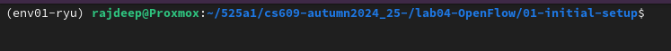

## 2.   Working with OpenFlow <a name="of"></a>

Move to the proper location by executing the following command:

```shell
cd ../02-open-flow-/
```

### 2.1 Preparing the environmnet for OpenFlow<a name="pro"></a>


1.  To install _mininet_ python library, run the following ccommand:

```shell
bash code01-install-mininet-in-python-environment.sh
```

2.  Check that there already exists an output file. You may check it using the below command.

```shell
ls | grep run
```

3. To delete it, execute the following command:

```shell
rm output01-static-flow.run
```
4. After deletion, cross-verify whether deletion is completed successfully or not. To do so, execute the following command:

```shell
ls | grep run
```
Match the output with the below snapshot.

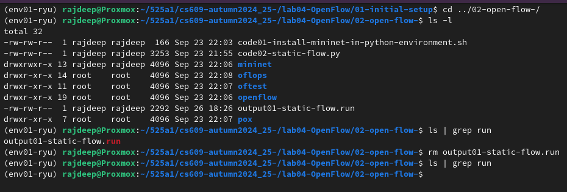


### 2.2 The OpenFlow topology with static flows <a name="of"></a>


####    2.2.1  What will we solve? <a name="ww"></a>

OpenFlow topology with static flows.

####    2.2.2   Naming convention <a name="nc"></a>


1.  Hosts: h1, h2, h3
2.  OVSSwitch: s1
3.  Controller: c0
4.  Bridge: br0

####    2.2.3   Problem at hand <a name="ph"></a>


We shall create a network topology and execute a few open-flow commands.

1.  Create a network using
    -   Mininet’s built-in OpenFlow reference controller (controller), and
    -   The OVSSwitch
2.  Add the following:
    -   three hosts: h1, h2, and h3, with IP 10.10.10.1, 10.10.10.2, and 10.10.10.1, respectively, and
    -   a switch s1, and
    -   links between the hosts and switch, and
    -   the default OpenFlow controller
3.  Start the network
4.  Initialize the  Open vSwitch database
5.  Print the following:
    -   a brief overview of the database contents
6.  Create a new bridge named br0
7.  Enable OpenFlow 1.0, 1.1, 1.2, and 1.3 on br0
8.  Print the following:
    -   OpenFlow version of the switch
    -   Print information on the switch to the console, including information on its flow tables and ports
    -   Print the statistics for each flow table the switch uses to the console.
    -   Print to the console statistics for network devices associated with the switch.
    -   Print switch's fragment handling mode.
    -   Print to the console all flow entries in the switch's tables that match flows.
    -   Print to the console aggregate statistics for flows in the switch's tables that match flows.
    -   Print to the console statistics for the specified queue on the port within the switch.
    -   Print to the console the statistics of bridge IPFIX for the switch.
    -   Print to the console the statistics of flow-based  IPFIX  for the switch.
    -   Print the list of protocols
9.  Apply the static rules:
    -   Forwarding rules between h1 and h2
        -   Traffic from h1 is forwarded to h2
        -   Traffic from h2 is forwarded to h1
    -   Forwarding rules between h1 and h3
        -   Traffic from h1 is forwarded to h3
        -   Traffic from h3 is forwarded to h1
    -   Forwarding rules between h2 and h3
        -   Traffic from h2 is forwarded to h3
        -   Traffic from h3 is forwarded to h2
10. Verify the connectivity between the three hosts.

> [!TIP]
> The code is given below. Study the components of the code with the statements of the above questions.

```python
from mininet.net import Mininet
from mininet.node import OVSSwitch, Controller
from mininet.cli import CLI
from mininet.log import setLogLevel
import time


def lab_on_10september2024():
    # Create a Mininet network with an OpenFlow switch and controller
    net = Mininet(controller=Controller, switch=OVSSwitch)

    # Add three hosts
    h1 = net.addHost('h1', ip='10.10.10.1')
    h2 = net.addHost('h2', ip='10.10.10.2')
    h3 = net.addHost('h3', ip='10.10.10.3')

    # Add a switch
    s1 = net.addSwitch('s1')

    # Create links between the hosts and switch
    net.addLink(h1, s1)
    net.addLink(h2, s1)
    net.addLink(h3, s1)

    # Add default OpenFlow controller
    net.addController('c0')

    # Start the network
    net.start()
    
    
    
  
    
    #print("Switch connected to controller with OpenFlow version:")
    print(s1.cmd('ovs-vsctl init'))
    
    
    print(s1.cmd('ovs-vsctl show'))
    
    
    print(s1.cmd('ovs-vsctl add-br br0'))
    
    
    print(s1.cmd('ovs-vsctl set bridge br0 protocols=OpenFlow10,OpenFlow12,OpenFlow13'))
   
    print(s1.cmd('ovs-ofctl -V'))
    
    
    print(s1.cmd('ovs-ofctl show br0'))
    
    print(s1.cmd('ovs-ofctl dump-tables br0'))
    
    print(s1.cmd('ovs-ofctl dump-ports br0'))
    
    print(s1.cmd('ovs-ofctl get-frags br0'))
    
    print(s1.cmd('ovs-ofctl dump-flows br0'))
    
    print(s1.cmd('ovs-ofctl dump-aggregate br0'))
    
    print(s1.cmd('ovs-ofctl queue-stats br0'))
    
    print(s1.cmd('ovs-ofctl dump-ipfix-bridge br0'))
    
    print(s1.cmd('ovs-ofctl dump-ipfix-flow br0'))
    

    # Show OpenFlow version of the switch
    print("Switch connected to controller with OpenFlow version:")


    print(s1.cmd('ovs-vsctl get bridge br0 protocols'))

    # Add static OpenFlow rules using ovs-ofctl
    # Rule 1: Forward packets from h1 to h2 (through port 2)
    print("Rule 1 starts here")
    print(s1.cmd('ovs-ofctl add-flow s1 priority=10,in_port=1,actions=output:2'))
    print("Rule 1 ends here")

    # Rule 2: Forward packets from h2 to h1 (through port 1)
    print(s1.cmd('ovs-ofctl add-flow s1 priority=10,in_port=2,actions=output:1'))
    print("Rule 2 ends here")

    # Rule 3: Forward packets from h1 to h3 (through port 3)
    s1.cmd('ovs-ofctl add-flow s1 priority=10,in_port=1,actions=output:3')
    print("Rule 3 ends here")

    # Rule 4: Forward packets from h3 to h1 (through port 1)
    s1.cmd('ovs-ofctl add-flow s1 priority=10,in_port=3,actions=output:1')
    print("Rule 4 ends here")

    # Rule 5: Forward packets from h2 to h3 (through port 3)
    s1.cmd('ovs-ofctl add-flow s1 priority=10,in_port=2,actions=output:3')
    print("Rule 5 ends here")

    # Rule 6: Forward packets from h3 to h2 (through port 2)
    s1.cmd('ovs-ofctl add-flow s1 priority=10,in_port=3,actions=output:2')
    print("Rule 6 ends here")

    # Test connectivity by pinging between hosts
    print("Testing connectivity with pingall:")
    net.pingAll()

    # Open Mininet CLI for further testing and debugging
    #CLI(net)

    # Stop the network
    net.stop()

if __name__ == '__main__':
    print("This is CS609 Lab. Execution starts")
    time.sleep(5)
    lab_on_10september2024()
    print("Execution ends")
    time.sleep(5)
```

####    2.2.4   Solution  <a name="sol1"></a>

1.  Run the following command in the terminal to execute it:

```shell
sudo python3 code02-static-flow.py
```

2.  Check the following execution for hints.


---

3.	To save the output, use the following command:

```shell
sudo python3 code02-static-flow.py >> output01-static-flow.run
```

4.	To view the output, the the following command:
```shell
vim output01-static-flow.run
```

5.	To return to the terminal, use the following command:
	-	:
	-	q
	-	!
	-	Press the Enter key


## 3.   Working with TShark <a name="ts"></a>

1.	Go to the proper location by using the follosing command:
```shell
cd ../03-tshark-/
```

2.	To install tshark run the following command:
```shell
bash 01-tshark-install.sh
```
>   [!NOTE] 
>  Make sure that *yes* is colored as *red* when the following dialogue box appear. To do so, use the *left-and-right* arrow key.

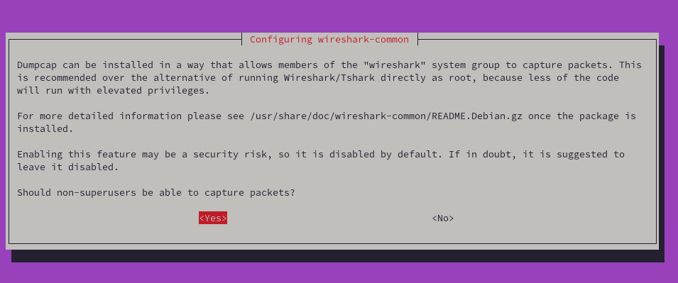

>

3.	Once installation is completed at your terminal, use the following command to check the version:
```shell
bash 02-tshark-version-check.sh
```

4.	To add tshark to the current group, use the following command:
```shell
bash 03-tshark-add-to-group.sh
```

5.	To capture packets, start tshark using the following command:
```shell
bash 04-tshark-capture-packets.sh
```
>   [!NOTE] 
>  A sample output is below:

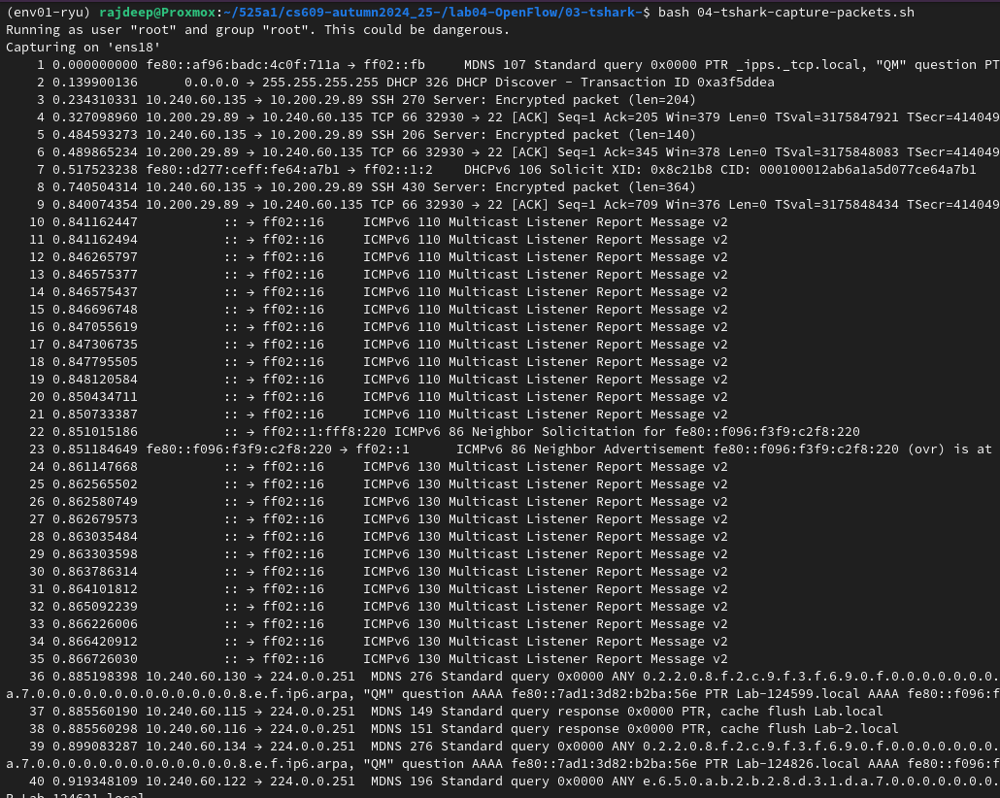

>
  

6.	To view the list of all interfaces, use the followiing command:
```shell
bash 05-tshark-list-of-all-interfaces.sh
```

7.	To scan a network, use the following command:
```shell
bash 06-tshark-scan-one-network-interface.sh
```

8.	To capture ten packets, use the following command:
```shell
bash 07-tshark-capture-ten-packets.sh
```
>   [!NOTE] 
>  A sample output is below:

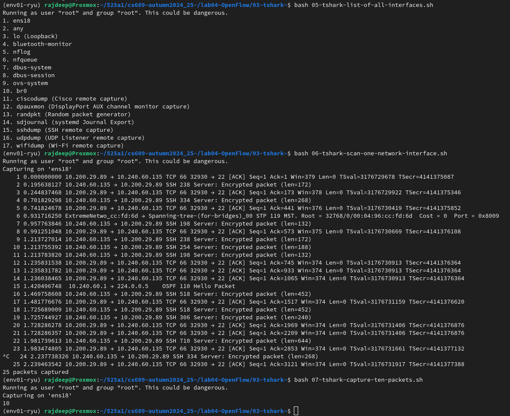

>
 
9.	To view the result, rub the following command:
```shell
cat output01.this-is-the-result
```

## 4.   Working with Ryu: first example <a name="ry1"></a>

1. To navigate to the proper directory, run the following command:
```shell
cd ../04-ryu-/01-ryu-install/
```

2.  To install Ryu, use the following command:
```shell
bash script07-install-ryu-and-test.sh
```

3. Navigate to the proper directory by issuing the following command:
```shell
cd ../02-experiment-with-ryu/
```
Let us call this current terminal as the *first terminal*.

4. We need another terminal. So open another terminal side-by-side. Let us call it as the *second terminal*. In the *second terminal*, please log in to your same VM using the *ssh* command. A sample status is available in the following image:

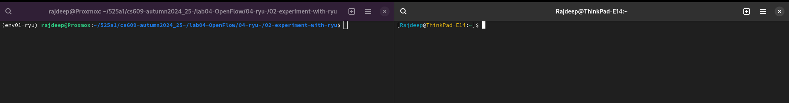


In the following discussion, the *first terminal* will be in the *left hand side* and the *second terminal* will be in the *right hand side*.


5. In the *second terminal*, activate the desired python *virtual environment* by issuing the following command:
```shell
conda activate env01-ryu
```


6. In the *second terminal*, navigate to the desired location by issuing the following command:
```shell
cd 525a1/cs609-autumn2024_25-/lab04-OpenFlow/04-ryu-/02-experiment-with-ryu/
```


>   [!NOTE] 
> Make sure that the *present working directory* in both of the terminals i.e., *first terminal* and the *second terminal* are identical.   A sample output is below:

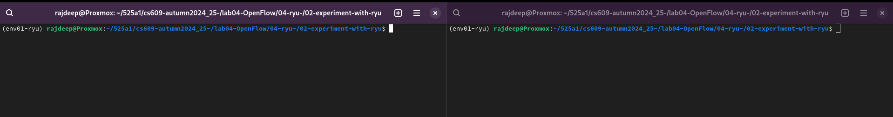

>

7. In the *first terminal*, i.e., in the *left hand side*, run the following command:
```shell
ryu-manager ../01-ryu-install/ryu/ryu/app/simple_switch_13.py
```


8. In the *second terminal*, i.e., in the *right hand side*, run the following command:
```shell
sudo mn --controller=remote,ip=127.0.0.1 --mac -i 10.1.1.0/24 --topo=tree,depth=2,fanout=3	
```
A sample output is as follows:

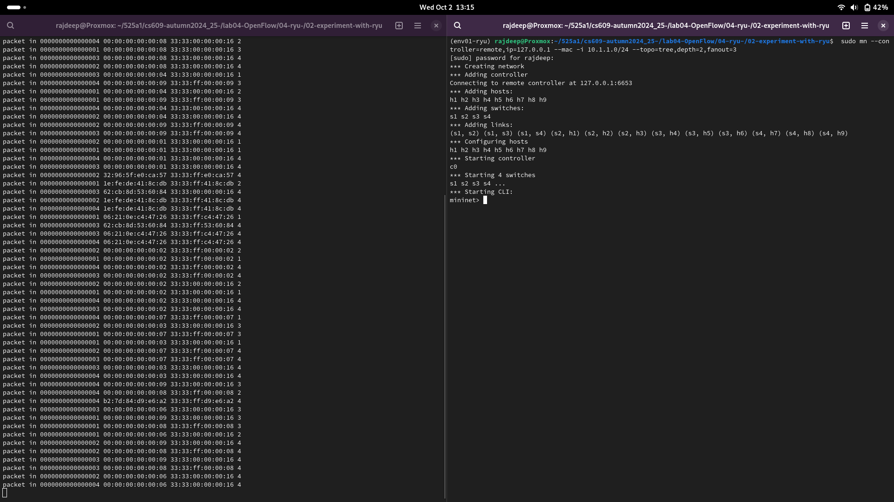


## 5.   Working with Ryu: Ryu with Tshark <a name="ry2"></a>

**Notation:** Here we will be needing three terminals. We shall call them *first terminal*, *second terminal*, and *third terminal* in the follosing discussion.

1.	Navigate to the desired location by executing the following command in both of the terminals:

cd ../03-experiment-with-ryu-and-tshark/

2. In the *first terminal*, type the following:
```shell
ryu-manager simple_switch.py
```

3. In the *second terminal*, type the following:
```shell
sudo mn --controller=remote,ip=127.0.0.1,port=6653 --switch=ovsk,protocols=OpenFlow13 --topo=tree,depth=2,fanout=4
```
4. Observe the output in the *first terminal*.

5. In the *second terminal* type the following:
```shell
pingall
```
6. Observe the output in the *first terminal*. A sample output is available below:

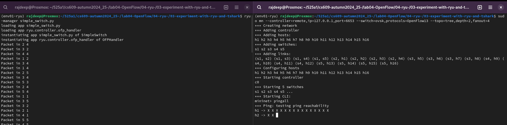

8. In a *third terminal*, execute the following commands:
	-	sudo tshark -D
	-	sudo tshark -i lo -Y tcp port 6653

9. And observe the *openflow packets* in the *third terminal*. A sample output is available below:
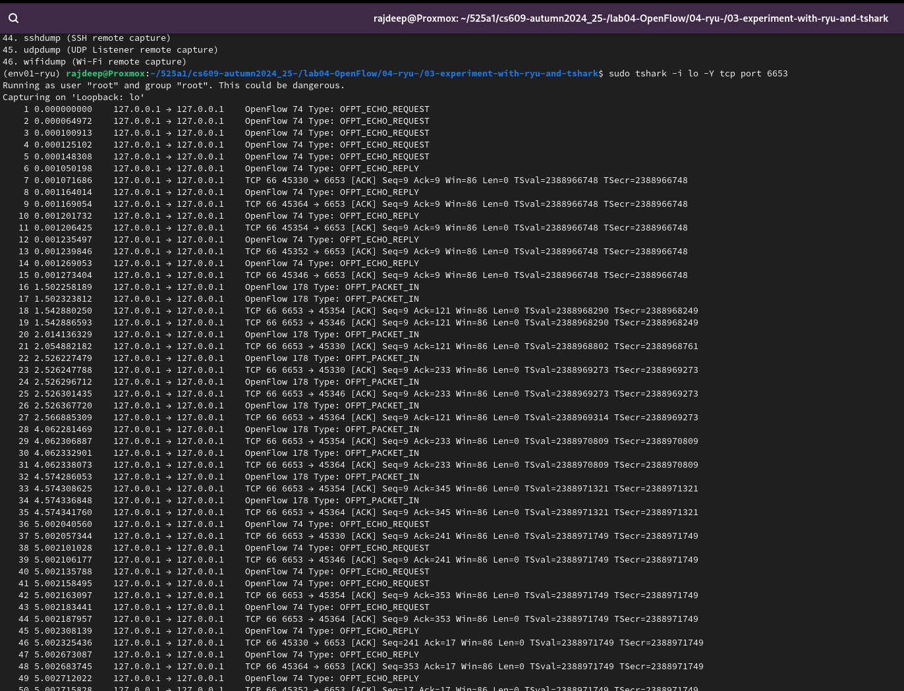

10. A sample video of the execution process is available below:


## 6.  Working with Ryu: Create router<a name="ry3"></a>

Navigate to the desired location by executing the following command:

```shell
cd ../04-create-router/
```

### 6.1.    Create topology<a name="ct"></a>

1.  Run the following command:
```shell
bash code01-copy-custom-topology.sh
```

2. Start mininet by executing the following command:
```shell
bash code02-run-custom-topology.sh
```

3.  In the *mininet shell*, type the following:
```shell
pingall
```

### 6.2 To set up hosts<a name="su"></a>

Run the following command one by one:
-   net
-   h1 ifconfig h1-eth0 10.0.1.1/24
-   h2 ifconfig h2-eth0 10.0.1.2/24
-   h1 route add default gw 10.0.1.1
-   h2 route add default gw 10.0.1.2
-   h1 route -n
-   net
-   dump

A sample snapshot is available below:

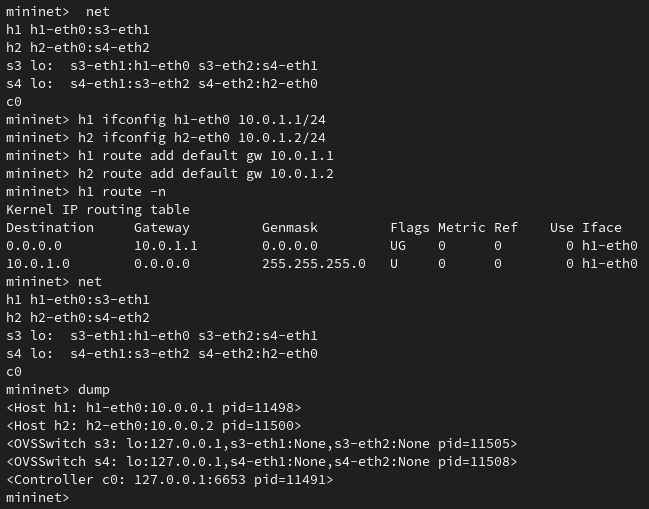


##	7.	Testing a remote desktop protocol <a name="rd"></a>
1.	Install [Remmina](https://remmina.org/) using this link.

2.  Install a desktop environment. In this case, we care going to install [xfce](https://www.xfce.org) desktop environment. To do so, use the following command:
```shell
sudo apt install xfce4 xfce4-goodies -y
```

3.  Install *xrdp* on ubuntu. To do so, execute the following:
```shell
sudo apt install xrdp -y
```

4.  To check the status, execute the following command.
```shell
sudo systemctl status xrdp
```
>   [!NOTE] 
> Make sure that the status is visible as *active (running)*   A sample output is below. If not, please do not proceed further, and ask for help.

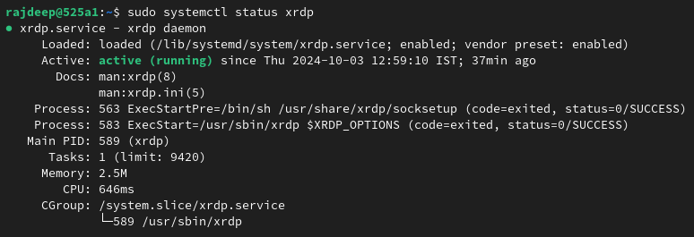


5.  To start xrdp, exxecute the following command:
```shell
sudo systemctl start xrdp
```

6. Navigate to the *home directory* by using the following command:
```shell
cd ~
```

7.  To create a `.xsession` file under the `HOME` directory, and addd the `fce4-session` as the *session manager*, run the following:
```shell
echo "xfce4-session" | tee .xsession
```

8.  Restart the `xrdp server` by executing the following command:
```shell
sudo systemctl restart xrdp
```

9.  To allow access to the RDP port 3389, execute the follosing command:
```shell
sudo ufw allow from any to any port 3389
```

10. Check status:
```shell
sudo ufw status
```

> [!CAUTION]
> If the *status* is not *Active*, then use the following step:
```shell
sudo ufw enable
```


> [!IMPORTANT]  
> Make sure that the output of the following command is *Active*
```shell
sudo ufw status
```

11. Done. Now open *Remmina* from your *local machine* and connect the VM using *RDP*. You may consider the following preview as a reference:
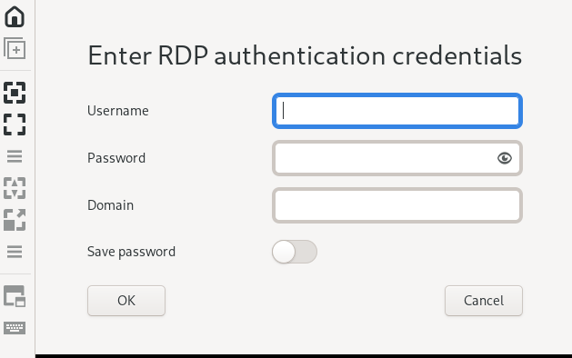

12. You may refer the following for a better understanding:


##	8.	Reference
1.	[Open vSwitch Manual: ovs-ofctl](http://www.openvswitch.org//support/dist-docs/ovs-ofctl.8.txt)
2.	[Using OpenFlow](https://docs.openvswitch.org/en/latest/faq/openflow/)
3.	[Open vSwitch Manual: ovs-vsctl](http://www.openvswitch.org/support/dist-docs/ovs-vsctl.8.txt)
4.	[TShark Manual Page](https://www.wireshark.org/docs/man-pages/tshark.html)
5.  [Enable Remote Desktop Protocol Using xrdp](https://www.digitalocean.com/community/tutorials/how-to-enable-remote-desktop-protocol-using-xrdp-on-ubuntu-22-04)


<!---
test
--->
---

[comment]: # (Comment)


