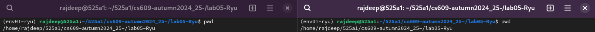

<h2 align="center" style="border-bottom: 5px dotted">
   <p> Software-Defined Networking and Network Function Virtualization, (CS-609)</p>
    <p> Autumn 2024-25, Indian Institute of Technology Dharwad </p>
    

</h2>


<!---
## Lab - 04: OpenFlow

### 01-initial-setup
-->


#   Lab Worksheet 05: Tuesday morning session, 08th October 2024. 
<!---

### Table of contents
1. [Preparing the environment](#pr)
2. [Working with OpenFlow](#of)
    -   [2.1    Preparing the environmnet for OpenFlow](#pro)
    -   [2.2    The OpenFlow topology with static flows](#of)
        -   [2.2.1  What will we solve?](#ww)
        -   [2.2.2  Naming convention](#nc)
        -   [2.2.3  Problem at hand](#ph)
        -   [2.2.4  Solution](#sol1)

3. [Working with TShark](#ts)
4. [Working with Ryu: first example](#ry1)
5. [Working with Ryu: Ryu with Tshark](#ry2)
6. [Working with Ryu: Create router](#ry3)
    -   [6.1    Create topology](#ct)
    -   [6.2    To set up hosts](#su)
7.	[Testing a remote desktop protocol](#rd)
8. [Reference](#ref)
--->

### Table of contents

1.	[Initialization step](#is)
1.	[Switching Hub](#sh)
2.	[Traffic Monitor](#tm)
3.	[REST Linkage](#rl)
4.	[Link Aggregation](#la)
5.	[Spanning Tree](#st)
6.	[Firewall](#f)
7.	[Router](#r1)
8.	[Reference](#r2)
---
<!---

##  1. Preparing the environment <a name="pr"></a>


--->


**Notation:** We shall be working with two *terminals*, next to each other. In the follosing discussion, the words *first terminal* and *left terminal* are used interchangeably. Similarly, the words *second terminal* and *right terminal* are used interchangeably. 


##	Initialization step <a	name="is"></a>

### How many terminals do we need here?

Two.

### Execute the following steps in both of the terminals

1.	Please navigate to the *desired location*. By the term *desired location*, we mean that the *present working directory* should be `525a1`. To do so, run the following command:
```shell
cd 525a1/
```

2.	Please execute the following command at the *desired location* to fetch and download content from [this GitHub repository](https://github.com/rajdeepbaru/525a1/tree/main) and immediately update your *local repository* to match that content:
```shell
git pull
```

3.	Please activate the desired *virtual environment* `env01-ryu` by executing the following command:
```shell
conad activate env01-ryu
```

5.	Now we shall navigate to the subdirectory for todays lab session. To do so, execute the following command:
```shell
cd cs609-autumn2024_25-/lab05-Ryu/
```

6.  For example, you may refer to the follosing diagram:


7..	We are all set to proceed to the following step.


---


##	Switching Hub	<a	name="sh"></a>

-	**Brief overview:** Please read about [*Switching Hub*](https://book.ryu-sdn.org/en/html/switching_hub.html) before proceeding further.
-	**Experiment objective:** In this setup, we shall have a functioning *switching hub* using the Ryu controller that learns MAC addresses and reduces flooding.


### Our job is to execute the Ryu application and verify the output

1.  We shall create a Mininet network with one switch and three hosts connected to it. We shall assign MAC addresses to the hosts automatically, use Open vSwitch for the switch, connects to a remote SDN controller, and try to open a terminal interface for each node. To do so, execute the follosing command in the *right termianl* or equivalently *second terminal*.
```shell
sudo mn --topo single,3 --mac --switch ovsk --controller remote -x
```


In s1: 
ovs-vsctl show
ovs-dpctl show
ovs-vsctl set Bridge s1 protocols=OpenFlow13
ovs-ofctl -O OpenFlow13 dump-flows s1

In c0:
ryu-manager --verbose ryu.app.example_switch_13

In s1:
# ovs-ofctl -O openflow13 dump-flows s1

In h1:
# tcpdump -en -i h1-eth0

In h2:
# tcpdump -en -i h2-eth0


In h3:
# tcpdump -en -i h3-eth0


In mn:
mininet> h1 ping -c1 h2

In s1:
# ovs-ofctl -O openflow13 dump-flows s1

Look at controller


In h1:
# tcpdump -en -i h1-eth0

In h2:
# tcpdump -en -i h2-eth0

In h3:
# tcpdump -en -i h3-eth0


##	Traffic Monitor	<a	name="tm"></a>

##	REST Linkage	<a	name="rl"></a>

##	Link Aggregation	<a	name="la"></a>

##	Spanning Tree	<a	name="st"></a>

##	Firewall	<a	name="f"></a>

##	Router	<a	name="r1"></a>

##	a9	Reference	<a	name="r2"></a>
1.	[RYU SDN Framework](https://book.ryu-sdn.org/en/html/)

<!---
test
--->
---

[comment]: # (Comment)


