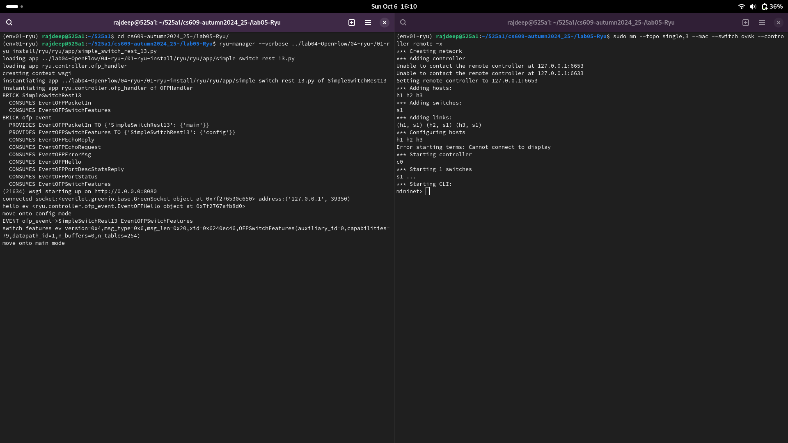
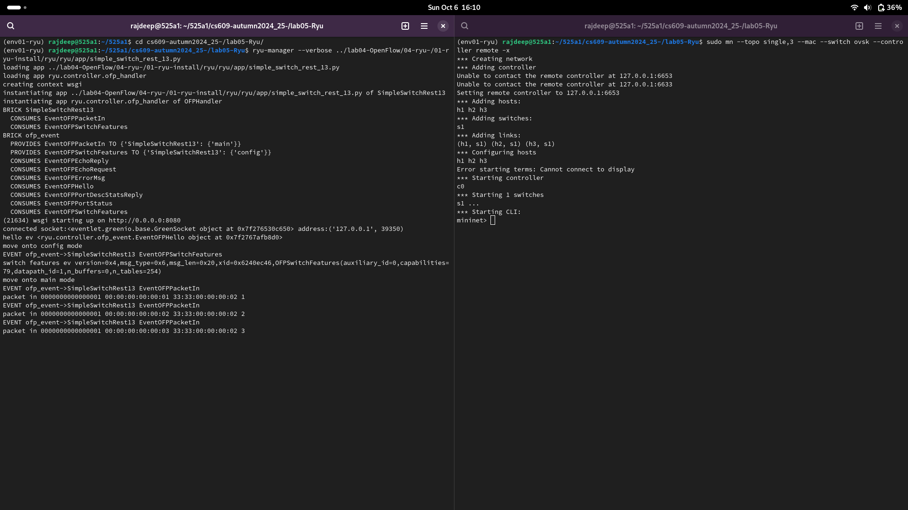
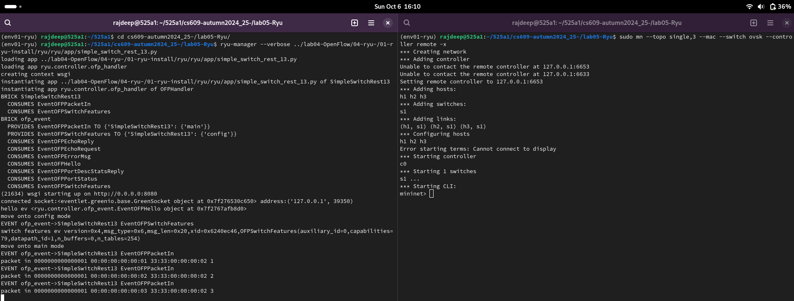
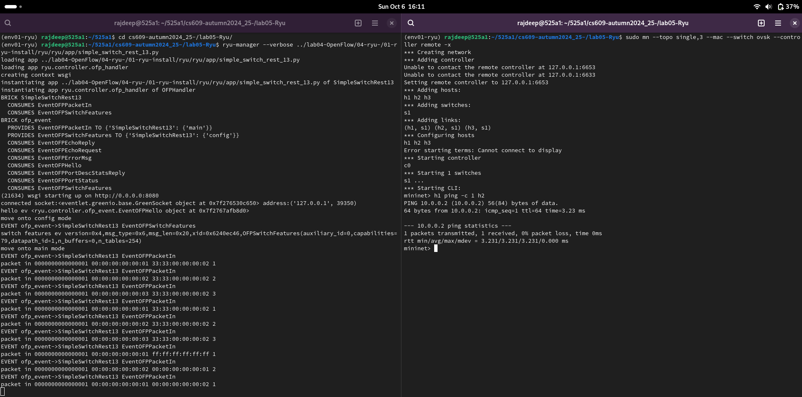
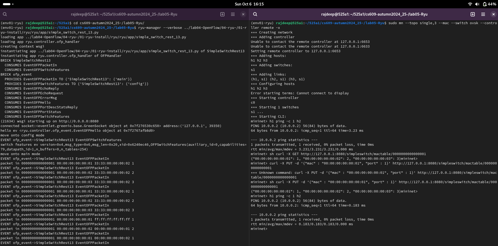

<h2 align="center" style="border-bottom: 5px dotted">
   <p> Software-Defined Networking and Network Function Virtualization, (CS-609)</p>
    <p> Autumn 2024-25, Indian Institute of Technology Dharwad </p>
    

</h2>


<!---
## Lab - 04: OpenFlow

### 01-initial-setup
-->


#   Lab Worksheet 05: Tuesday morning session, 08th October 2024. 
<!---

### Table of contents
1. [Preparing the environment](#pr)
2. [Working with OpenFlow](#of)
    -   [2.1    Preparing the environmnet for OpenFlow](#pro)
    -   [2.2    The OpenFlow topology with static flows](#of)
        -   [2.2.1  What will we solve?](#ww)
        -   [2.2.2  Naming convention](#nc)
        -   [2.2.3  Problem at hand](#ph)
        -   [2.2.4  Solution](#sol1)

3. [Working with TShark](#ts)
4. [Working with Ryu: first example](#ry1)
5. [Working with Ryu: Ryu with Tshark](#ry2)
6. [Working with Ryu: Create router](#ry3)
    -   [6.1    Create topology](#ct)
    -   [6.2    To set up hosts](#su)
7.	[Testing a remote desktop protocol](#rd)
8. [Reference](#ref)
--->

### Table of contents

1.	[Initialization step](#is)
2.  [Ryu SDN framework](#rf)
    -   2.1. [Switching Hub](#sh)
    -   2.2. [Traffic Monitor](#tm)
    -   2.3 [REST Linkage](#rl)
3.  [OpenFlow protocol](#la)
4.	[Reference](#r2)

---

<!---

##  1. Preparing the environment <a name="pr"></a>


--->


**Notation:** We shall be working with two *terminals*, next to each other. In the follosing discussion, the words *first terminal* and *left terminal* are used interchangeably. Similarly, the words *second terminal* and *right terminal* are used interchangeably. 


##	1. Initialization step <a	name="is"></a>

### 1.1 How many terminals do we need here?

Two.

### 1.2 Execute the following steps in both of the terminals

1.	Please navigate to the *desired location*. By the term *desired location*, we mean that the *present working directory* should be `525a1`. To do so, run the following command:
```shell
cd 525a1/
```

2.	Please execute the following command at the *desired location* to fetch and download content from [this GitHub repository](https://github.com/rajdeepbaru/525a1/tree/main) and immediately update your *local repository* to match that content:
```shell
git pull
```

3.	Please activate the desired *virtual environment* `env01-ryu` by executing the following command:
```shell
conad activate env01-ryu
```

5.	Now we shall navigate to the subdirectory for todays lab session. To do so, execute the following command:
```shell
cd cs609-autumn2024_25-/lab05-Ryu/
```

6.  For example, you may refer to the follosing diagram:


7..	We are all set to proceed to the following step.


---

## 2. Ryu SDN framework <a	name="rf"></a>

###	2.1 Switching Hub	<a	name="sh"></a>

-	**Brief overview:** Please read about [*Switching Hub*](https://book.ryu-sdn.org/en/html/switching_hub.html) before proceeding further.
-	**Experiment objective:** In this setup, we shall have a functioning *switching hub* using the Ryu controller that learns MAC addresses and reduces flooding.

-   **Relevant python code:** 


#### 2.1.1 Our job is to execute the Ryu application and verify the output

1.  We shall create a Mininet network with one switch and three hosts connected to it. We shall assign MAC addresses to the hosts automatically, use Open vSwitch for the switch, connects to a remote SDN controller, and try to open a terminal interface for each node. To do so, execute the following command in the *right termianl* or equivalently *second terminal*.
```shell
sudo mn --topo single,3 --mac --switch ovsk --controller remote -x
```

You may refer the following situationn for a reference.


2.  Let us check the status of the Open vSwitch. To do so, execute the following command in the *right terminal*:
```shell
sh ovs-vsctl show
```

You should get an output similar to the following reference:


3.  We shall print  a summary of configured datapaths, including their datapath numbers and a list of ports  connected  to  each  datapath. To do so, execute the following in  the *right terminal*:
```shell
ovs-dpctl show
```
You should get an output similar to the following reference:


4.  We shall set 1.3 for the OpenFlow version:

To do so, execute the following in  the *right terminal*:
```shell
ovs-vsctl set Bridge s1 protocols=OpenFlow13
```


5.  Let us check the empty flow table. To do so, execute the following in  the *right terminal*:
```shell
ovs-ofctl -O OpenFlow13 dump-flows s1
```

6. The overall process till now is stated below:


7. Execute the following command in the *left terminal*. It will start *ryu manager*.
```shell
ryu-manager --verbose ../lab04-OpenFlow/04-ryu-/01-ryu-install/ryu/ryu/app/example_switch_13.py 
```

You should a similar output similar to the following:


> [!IMPORTANT]  
> Wait for ten seconds and you will see the following as output in the *left terminal*. This is because it may take time to connect to OVS.


8.  You may verify your steps and outputs with the following reference:


### 2.1.2 What happened?
The OVS is connected, handshake is done, the Table-miss flow entry has been added and the switching hub is in the status waiting for Packet-In.

9.  Now we shall confirm that the Table-miss flow entry has been added. To do so, execute the following in the *right terminal*. <a	name="s9"></a>
```shell
sh ovs-ofctl -O openflow13 dump-flows s1
```

> [!NOTE]  
>  The output should be similar to `cookie=0x0, duration=45.666s, table=0, n_packets=2, n_bytes=140, priority=0 actions=CONTROLLER:65535`

> [!IMPORTANT]  
> - The priority level is 0,
> - match,
> - bytes 140,
> - CONTROLLER is specified for action, and transfer data size of 65535(0xffff = OFPCML_NO_BUFFER) is specified.


> [!CAUTION]
> Our experimental results slightly differs with the [results mentioned here](https://book.ryu-sdn.org/en/html/switching_hub.html). **Can you identify the differenc between the two results?**


10. Please check all the network interfaces on your system. To do so, execute the following command:
```shell
sh ifconfig -a
```

You should see a output similar to the following:


11. We shall check packets were received by the hosts. For `h1`, execute the following:
```shell
sh tcpdump -en -i s1-eth1
```
> [!NOTE]  
>  The output should be similar to  
> `tcpdump: verbose output suppressed, use -v[v]... for full protocol decode`   
> `listening on s1-eth1, link-type EN10MB (Ethernet), snapshot length 262144 bytes`  
>  `07:50:39.580864 00:00:00:00:00:02 > 33:33:00:00:00:02, ethertype IPv6 (0x86dd), length 70: fe80::200:ff:fe00:2 > ff02::2: ICMP6, router solicitation, length 16` 


> [!IMPORTANT]  
> The output in the *left terminal* is 
> `EVENT ofp_event->ExampleSwitch13 EventOFPPacketIn
> packet in 1 00:00:00:00:00:02 33:33:00:00:00:02 2`


12. For reference, you may look into the following video:


13. To exit from the execution of the *right terminal*, press:

-   <Ctrl + c>

**Self evaluation quesion:** How many packets captured?

14. Execute each of the following commands and note your observation down.
-   `sh tcpdump -en -i s1-eth2`
-   `sh tcpdump -en -i s1-eth3`

15. Execute the following command to issue ping from host 1 to host 2:
```shell
mininet> h1 ping -c1 h2
```
You should see output similar to the following:   
`PING 10.0.0.2 (10.0.0.2) 56(84) bytes of data.`  
`64 bytes from 10.0.0.2: icmp_seq=1 ttl=64 time=2.80 ms`  
 
`--- 10.0.0.2 ping statistics ---`  
`1 packets transmitted, 1 received, 0% packet loss, time 0ms`  
`rtt min/avg/max/mdev = 2.799/2.799/2.799/0.000 ms` 

> [!NOTE]
> In the *first terminal*, you should see an output similar to the following:  
> `EVENT ofp_event->ExampleSwitch13 EventOFPPacketIn`  
> `packet in 1 00:00:00:00:00:01 ff:ff:ff:ff:ff:ff 1`  
> `EVENT ofp_event->ExampleSwitch13 EventOFPPacketIn`  
> `packet in 1 00:00:00:00:00:02 00:00:00:00:00:01 2`  
> `EVENT ofp_event->ExampleSwitch13 EventOFPPacketIn`  
> `packet in 1 00:00:00:00:00:01 00:00:00:00:00:02 1`  
  


13. For reference, you may look into the following video:


14. We shall check the flow table. In the *right terminal*, execute the following command:
```shell
sh ovs-ofctl -O OpenFlow13 dump-flows s1
```

> [!NOTE]
> The output should be similar to the following:   
> `cookie=0x0, duration=20.055s, table=0, n_packets=2, n_bytes=140, priority=1,in_port="s1-eth2",dl_dst=00:00:00:00:00:01 actions=output:"s1-eth1"`  
> `cookie=0x0, duration=20.054s, table=0, n_packets=1, n_bytes=42, priority=1,in_port="s1-eth1",dl_dst=00:00:00:00:00:02 actions=output:"s1-eth2"`  
> `cookie=0x0, duration=260.171s, table=0, n_packets=8, n_bytes=532, priority=0 actions=CONTROLLER:65535`  


15. For reference, you may look into the following video:


> [!IMPORTANT]  
> Compare this output with the output [above, in step 9](#s9).  

**What happened?**
-   Receive port (in_port):2, Destination MAC address (dl_dst):host 1 -> Action (actions):Transfer to port 1 
-   Receive port (in_port):1, Destination MAC address (dl_dst): host 2 -> Action (actions): Transfer to port 2

> [!CAUTION]
> Our experimental results slightly differs with the [results mentioned here](https://book.ryu-sdn.org/en/html/switching_hub.html). **Can you identify the differenc between the two results?**


16. Let us take a look at the output of tcpdump executed on each host. To do so, execute the following command:
```shell
sh tcpdump -en -i s1-eth1
```


You should see an output similar to below in *right terminal*:  
`tcpdump: verbose output suppressed, use -v[v]... for full protocol decode`  
`listening on s1-eth1, link-type EN10MB (Ethernet), snapshot length 262144 bytes`  
`07:53:19.323956 00:00:00:00:00:01 > 33:33:00:00:00:02, ethertype IPv6 (0x86dd), length 70: fe80::200:ff:fe00:1 > ff02::2: ICMP6, router solicitation, length 16`  

In the *left terminal*, you should see an output similar to following:
`EVENT ofp_event->ExampleSwitch13 EventOFPPacketIn`  
`packet in 1 00:00:00:00:00:01 00:00:00:00:00:02 1`  


**Self evaluation quesion:** What is the output of tcpdump executed on `s1-eth2` and `s1-eth3`?


---


###	2.2 Traffic Monitor	<a	name="tm"></a>

-	**Brief overview:** Please read about [*Traffic Monitor*](https://book.ryu-sdn.org/en/html/traffic_monitor.html) before proceeding further.
-	**Experiment objective:** In this setup, we shall add a function to monitor OpenFlow switch statistical information to the switching hub.
-   **Motivation for this experiment:** Networks have already become the infrastructure of many services and businesses, so maintaining of normal and stable operation is expected. Having said that, problems always occur.
    -   When an error occurred on network, the cause must be identified and operation restored quickly. Needless to say, in order to detect errors and identify causes, it is necessary to understand the network status on a regular basis. For example, assuming the traffic volume of a port of some network device indicates a very high value, whether it is an abnormal state or is usually that way and when it became that way cannot be determined if the port’s traffic volume has not been measured continuously.
    -   For this reason, constant monitoring of the health of a network is essential for continuous and safe operation of the services or businesses that use that network. As a matter of course, simply monitoring traffic information does not provide a perfect guarantee but this section describes how to use OpenFlow to acquire statistical information for a switch.


-   **Relevant python code:** 


1. Follow the [Initialization step](#is) for the two terminals.

2. To set OpenFlow13 for the OpenFlow version, execute the following steps in the *right terminal*:
```shell
sudo mn --topo single,3 --mac --switch ovsk --controller remote -x
```

```shell
sh ovs-vsctl show
```

```shell
sh ovs-dpctl show
```

```shell
sh ovs-vsctl set Bridge s1 protocols=OpenFlow13
```

3. To execute the traffic monitor, run the following in the *left terminal*:
```shell
ryu-manager --verbose ../lab04-OpenFlow/04-ryu-/01-ryu-install/ryu/ryu/app/simple_monitor_13.py
```

4. Do `ping` from `host 1` to `host 2`. The output will be similar to the following:


5. Do `pingall`. The output will be similar to the following:


6. For reference, you may look at the following video:


---


###	2.3 REST Linkage	<a	name="rl"></a>

We shall add a REST link function to the switching hub.
-	**Brief overview:** Please read about [*REST Linkage*](https://book.ryu-sdn.org/en/html/rest_api.html) before proceeding further.

-   **Relevant python code:** 


1. Follow the [Initialization step](#is) for the two terminals.

2. To set OpenFlow13 for the OpenFlow version, execute the following steps in the *right terminal*:
```shell
sudo mn --topo single,3 --mac --switch ovsk --controller remote -x
```

```shell
sh ovs-vsctl show
```

```shell
sh ovs-dpctl show
```

```shell
sh sudo ovs-vsctl set Bridge s1 protocols=OpenFlow13
```

3. To execute the traffic monitor, run the following in the *left terminal*:
```shell
ryu-manager --verbose ../lab04-OpenFlow/04-ryu-/01-ryu-install/ryu/ryu/app/simple_switch_rest_13.py
```




4. In the *right terminal*, execute the following:
```shell
h1 ping -c 1 h
```

> [!NOTE]
> `The output should be similar to following:`   
> `EVENT ofp_event->SimpleSwitchRest13 EventOFPPacketIn`   
> `packet in 0000000000000001 00:00:00:00:00:01 33:33:00:00:00:02 1`   
> `EVENT ofp_event->SimpleSwitchRest13 EventOFPPacketIn`   
> `packet in 0000000000000001 00:00:00:00:00:02 33:33:00:00:00:02 2`   
> `EVENT ofp_event->SimpleSwitchRest13 EventOFPPacketIn`   
> `packet in 0000000000000001 00:00:00:00:00:03 33:33:00:00:00:02 3`   
> `EVENT ofp_event->SimpleSwitchRest13 EventOFPPacketIn`   
> `packet in 0000000000000001 00:00:00:00:00:01 33:33:00:00:00:02 1`   
> `EVENT ofp_event->SimpleSwitchRest13 EventOFPPacketIn`   
> `packet in 0000000000000001 00:00:00:00:00:02 33:33:00:00:00:02 2`   
> `EVENT ofp_event->SimpleSwitchRest13 EventOFPPacketIn`   
> `packet in 0000000000000001 00:00:00:00:00:03 33:33:00:00:00:02 3`   








5. Let us execute REST API that acquires the MAC table of the switching hub. This time, use the curl command to call REST API. To do so, execute the following command:
```shell
curl -X GET http://127.0.0.1:8080/simpleswitch/mactable/0000000000000001
```

> [!TIP]
> The output in the *right terminal* should be similar to following:  
> `{"00:00:00:00:00:01": 1, "00:00:00:00:00:02": 2, "00:00:00:00:00:03": 3}`  


> [!CAUTION]
> Our experimental results slightly differs with the [results mentioned here](https://book.ryu-sdn.org/en/html/rest_api.html). **Can you identify the differenc between the two results?**


> [!TIP]
> The output in the *left terminal* should be similar to following:  
> `(21634) accepted ('127.0.0.1', 58836)`  
> `127.0.0.1 - - [06/Oct/2024 16:12:17] "GET /simpleswitch/mactable/0000000000000001 HTTP/1.1" 200 180 0.000787`  

6. Now call REST API for updating of the MAC address table for each host. The data format when calling REST API shall be {``mac`` : ``MAC address``, ``port`` : Connection port number}.

```shell
curl -X PUT -d '{"mac" : "00:00:00:00:00:01", "port" : 1}' http://127.0.0.1:8080/simpleswitch/mactable/0000000000000001
```


> [!TIP]
> The output in the *right terminal* should be similar to following:  
> {"00:00:00:00:00:01": 1, "00:00:00:00:00:02": 2, "00:00:00:00:00:03": 3}


> [!CAUTION]
> Our experimental results slightly differs with the [results mentioned here](https://book.ryu-sdn.org/en/html/rest_api.html). **Can you identify the differenc between the two results?**


> [!TIP]
> The output in the *left terminal* should be similar to following:  
> `(21634) accepted ('127.0.0.1', 59148)`  
> `127.0.0.1 - - [06/Oct/2024 16:14:20] "PUT /simpleswitch/mactable/0000000000000001 HTTP/1.1" 200 180 0.000377`  
> `EVENT ofp_event->SimpleSwitchRest13 EventOFPPacketIn`  
> `packet in 0000000000000001 00:00:00:00:00:03 33:33:00:00:00:02 3`  


4. Do `ping` from `host 1` to `host 2`. The output will be similar to the following:

```shell
h1 ping -c 1 h2
```



> [!TIP]
> The output in the *right terminal* should be similar to following:
> `PING 10.0.0.2 (10.0.0.2) 56(84) bytes of data.`  
> `64 bytes from 10.0.0.2: icmp_seq=1 ttl=64 time=0.183 ms`  
> `--- 10.0.0.2 ping statistics ---`  
> `1 packets transmitted, 1 received, 0% packet loss, time 0ms`  
> `rtt min/avg/max/mdev = 0.183/0.183/0.183/0.000 ms`  




> [!CAUTION]
> Our experimental results slightly differs with the [results mentioned here](https://book.ryu-sdn.org/en/html/rest_api.html). **Can you identify the differenc between the two results?**


<!---

--->


5. Do `pingall`. Checl the output in both of the terminals.

<!---

--->


---


##	3. OpenFlow protocol	<a	name="la"></a>

There are *match*, *instructions* and *actions* defined in the OpenFlow protocol. 
-   **Match:** There are a variety of conditions that can be specified to match, and it grows each time OpenFlow is updated.
-   **Instruction:** The instruction is intended to define what happens when a packet corresponding to the match is received.
-   **Action:** The OFPActionOutput class is used to specify packet forwarding to be used in Packet-Out and Flow Mod messages. 

Please go through [OpenFlow Protocol](https://book.ryu-sdn.org/en/html/openflow_protocol.html) for the details.


---


##  4. Reference	<a	name="r2"></a>
-   [RYU SDN Framework](https://book.ryu-sdn.org/en/html/)

<!---
test
--->
---

[comment]: # (Comment)


