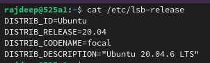
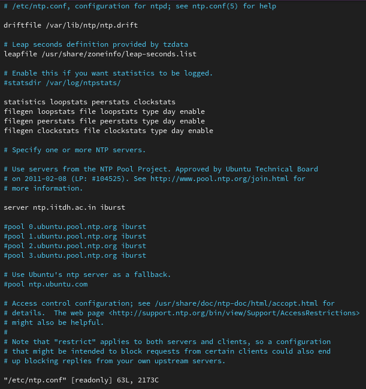

<h2 align="center" style="border-bottom: 5px dotted">
   <p> Software-Defined Networking and Network Function Virtualization (CS-609)</p>
    <p> Autumn 2024-25, Indian Institute of Technology Dharwad </p>
    <p> Lab Worksheet 06, Tuesday morning session, 22nd October 2024 </p>
    

</h2>

<h2 align="center" style="border-bottom: 5px dotted">
   <p> Topic covered: OpenStack </p>
    

</h2>


<!---
## Lab - 04: OpenFlow

### 01-initial-setup
-->
<!---
### Table of contents 
1.	[Some understanding](#1)
    -   1.1.  [What is ONOS?](#1.1)
    -   1.2.  [Features of ONOS](#1.2)

2.  [Installation of ONOS and its verification](#2)
    -   2.1. [Specifications we shall be using for this lab worksheet](#2.1)
    -   2.2. [Synchronize your working directory and navigate to the desired location](#2.2)
    -   2.3. [Preparation of the ground for installation of ONOS](#2.3)
        -   2.3.1. [Working with docker](#2.3.1)
        -   2.3.2. [Working with Distrobox](#2.3.2)
    -   2.4 [Installing ONOS on a single machine](#2.4)
    -   2.5. [Cross-checking the installation process](#2.5)

3. [Starting the components of ONOS](#3)
    -   3.1. [Starting Karaf](#2.6)
        -   3.1.1. [What is Karaf?](#2.6.1)
        -   3.1.2. [An example](#2.6.2)
        -   3.1.3. [How is it related to ONOS?](#2.6.3)
        -   3.1.4. [Starting Karaf CLI in a new terminal](#2.6.4)
    -   3.2. [Running ONOS as a service](#2.7)
        -   3.2.1.  [Install the service files](#271)
        -   3.2.2.  [Steps for Systemd based systems](#272)
    -   3.3. [Accessing the ONOS GUI](#29)
    -   3.4. [Starting ONOS CLI in a new terminal](#28)
4.  [Working with some ONOS CLI using some commands](#4)
    -   onos:ui-views 
    -   onos:ui-prefs
    -   maps
    -   exports
    -   info
    -   onos:ui-prefs 
    -   metrics
    -   bundle:info
    -   system:name and system:version
    -   bundle:classes
    -   feature-list
    -   bundle:list 
    -   bundle:services
    -   driver-providers
5.  [Mininet and ONOS](#5)
6.  [References](#6)
-->

---

**Lab objective:** 
<!--- The objective of performing an ONOS Lab (Open Network Operating System Lab) typically revolves around understanding and experimenting with the capabilities of ONOS, a software-defined networking (SDN) controller platform. The specific objectives for today's lab is to do some experimenting with *SDN Concepts using ONOS*. 
--->

---


# 1. Cross-check and setup

## 1.1. Specification used

1.  **Operating system with version:** Ubuntu 20.04. Please cross-verify the system you are using before proceeding further. 
<h2 align="center" >

</h2>

## 1.2 Install all pakage requirements in one go for this lab hours
1. Please clone the GitHub repository by using the following command in your terminal:
```shell
https://github.com/rajdeepbaru/525a1.git
```

2. Please navigate to the desired directory for today's lab session by using the following command in your terminal:
```shell
cd 525a1/cs609-autumn2024_25-/lab06-OpenStack/
```

2. Please execute the following command in your terminal
```shell
bash ../../.supporting-files/lab06-openstack/installAll-for-lab06.sh
```


# 2. Synchronize Time with NTP in Your PC by configuring 

1. Please follow the [NTP Synchronize steps mentioned at our intranet by our CCS team](https://intranet.iitdh.ac.in:444/CCS.php). You should get an output similar to the following:
<h2 align="center" >

</h2>


# 1. Working with the Network Time Protocol (NTP)

## 1.1 Controller node

### 1.1.1. Install and configure components

1. Install the packages:
```shell
sudo apt install chrony
```

2. Edit the `chrony.conf` file and add, change, or remove the following keys as necessary for your environment. In `/etc/chrony/chrony.conf`
```shell
server ntp.iitdh.ac.in iburst
```

3. To enable other nodes to connect to the chrony daemon on the controller node, add the following key to the  `chrony.conf` file mentioned above:
```shell
allow 10.0.0.0/24
```

4. Restart the NTP service by using the following command:
```shell
service chrony restart
```

### 1.1.2. Verify

1. Please execute the following command and cross-verify the corresponding output:
```shell
chronyc sources
```

2. Later to do.

# 2. Working with 


# References

1. [OpenStack Installation Guide](https://docs.openstack.org/install-guide/)
