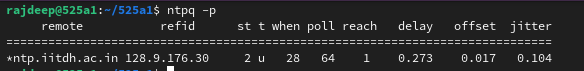

<h2 align="center" style="border-bottom: 5px dotted">
   <p> Software-Defined Networking and Network Function Virtualization (CS-609)</p>
    <p> Autumn 2024-25, Indian Institute of Technology Dharwad </p>
    <p> Lab Worksheet 06, Tuesday morning session, 22nd October 2024 </p>
    

</h2>

<h2 align="center" style="border-bottom: 5px dotted">
   <p> Topic covered: OpenStack </p>
    

</h2>


<!---
## Lab - 04: OpenFlow

### 01-initial-setup
-->
<!---
### Table of contents 
1.	[Some understanding](#1)
    -   1.1.  [What is ONOS?](#1.1)
    -   1.2.  [Features of ONOS](#1.2)

2.  [Installation of ONOS and its verification](#2)
    -   2.1. [Specifications we shall be using for this lab worksheet](#2.1)
    -   2.2. [Synchronize your working directory and navigate to the desired location](#2.2)
    -   2.3. [Preparation of the ground for installation of ONOS](#2.3)
        -   2.3.1. [Working with docker](#2.3.1)
        -   2.3.2. [Working with Distrobox](#2.3.2)
    -   2.4 [Installing ONOS on a single machine](#2.4)
    -   2.5. [Cross-checking the installation process](#2.5)

3. [Starting the components of ONOS](#3)
    -   3.1. [Starting Karaf](#2.6)
        -   3.1.1. [What is Karaf?](#2.6.1)
        -   3.1.2. [An example](#2.6.2)
        -   3.1.3. [How is it related to ONOS?](#2.6.3)
        -   3.1.4. [Starting Karaf CLI in a new terminal](#2.6.4)
    -   3.2. [Running ONOS as a service](#2.7)
        -   3.2.1.  [Install the service files](#271)
        -   3.2.2.  [Steps for Systemd based systems](#272)
    -   3.3. [Accessing the ONOS GUI](#29)
    -   3.4. [Starting ONOS CLI in a new terminal](#28)
4.  [Working with some ONOS CLI using some commands](#4)
    -   onos:ui-views 
    -   onos:ui-prefs
    -   maps
    -   exports
    -   info
    -   onos:ui-prefs 
    -   metrics
    -   bundle:info
    -   system:name and system:version
    -   bundle:classes
    -   feature-list
    -   bundle:list 
    -   bundle:services
    -   driver-providers
5.  [Mininet and ONOS](#5)
6.  [References](#6)
-->

---
### Table of contents 

0.  [Cross-checking the desktop](#0)
    -   0.1.    [Operating system used](#0.1)
    -   0.2.    [Installing packages](#0.2)

1.	[How to configure the environment](#1)
    -   1.1.    [Network Time Protocol ](#1.1)
    -   1.2.    [OpenStack packages](#1.2)
    -   1.3.    [SQL database](#1.3)
    -   1.4.    [Message queue](#1.4)
    -   1.5.    [Memcached](#1.5)
    -   1.6.    [Etcd](#1.6)

2.  [OpenStack services](#2)
    -   2.1. [To do](#2.1)
 
**Lab objective:** 
<!--- The objective of performing an ONOS Lab (Open Network Operating System Lab) typically revolves around understanding and experimenting with the capabilities of ONOS, a software-defined networking (SDN) controller platform. The specific objectives for today's lab is to do some experimenting with *SDN Concepts using ONOS*. 
--->

---


# 0. Cross-checking the desktop

## 0.1. Operating system used

1.  **Operating system with version:** Ubuntu 20.04. Please cross-verify the system you are using before proceeding further. 
<h2 align="center" >

</h2>

2. All the following steps are done in a dektop kept at 525-A1. Note the details:
    -   the IP is `10.230.3.154` 
    -   the username is `rajdeep`
    -   the password is `sdn@2024`

> [!NOTE] 
> In case you are stuck, you may verify the corresponding step with the system with IP `10.230.3.154`


## 0.2 Installing packages
Please clone the GitHub repository by using the following command in your terminal:
```shell
git clone https://github.com/rajdeepbaru/525a1.git
```

2. Please navigate to the desired directory for today's lab session by using the following command in your terminal:
```shell
cd 525a1/cs609-autumn2024_25-/lab06-OpenStack/
```

3. Please execute the following command in your terminal
```shell
bash ../../.supporting-files/lab06-openstack/installAll-for-lab06.sh
```

#   1.	How to configure the environment


##  1.1.    Network Time Protocol 

### 1.1.1. Synchronize Time with NTP in Your PC by configuring 

1. Please follow the [NTP Synchronize steps mentioned at our intranet by our CCS team](https://intranet.iitdh.ac.in:444/CCS.php).


2. After following all the steps mentioned there, you should get an output similar to the following when you will type `vim /etc/ntp.conf` in your terminal.
<h2 align="center" >

</h2>
<h2 align="center" >

</h2>

3. You may check whether *ntp* is installed or not by using `sudo apt list --installed | grep ntp`.


### 1.1.2. Controller node

1. **Do edit:**  Edit the `chrony.conf` file and add, change, or remove the following keys as necessary for your environment. To do so, type the following in your terminal:
```shell
sudo vim /etc/chrony/chrony.conf
```

2. Please add the following line in the file.
```shell
server ntp.iitdh.ac.in iburst
```

and comment the following four lines by placing a hash symbol at the beginning of each of the four lines.  
`pool ntp.ubuntu.com        iburst maxsources 4`   
`pool 0.ubuntu.pool.ntp.org iburst maxsources 1`  
`pool 1.ubuntu.pool.ntp.org iburst maxsources 1`  
`pool 2.ubuntu.pool.ntp.org iburst maxsources 2` 


and the following for *other nodes*
```shell
server controller iburst
```


3. **Enable other nodes:** To enable other nodes to connect to the chrony daemon on the controller node, add the following key to the  `chrony.conf` file mentioned above:
```shell
allow 10.230.0.0/20
```
You may verify with the following situation:

<h2 align="center" >

</h2>

> [!NOTE] 
>  Please make sure to modify the value `10.230.0.0/20` accordingly.


<h2 align="center" >

</h2>


4. **Do restart:** Restart the NTP service by using the following command:
```shell
service chrony restart
```
You may verify with the following situation:

<h2 align="center" >

</h2>

### 1.1.4. Verify

1. Please execute the following command and cross-verify the corresponding output:
```shell
chronyc sources
```
<h2 align="center" >

</h2>


2. Optionally you may verify as follows:

```shell
chronyc sourcestats
```
<h2 align="center" >

</h2>


##  1.2.    OpenStack packages


##  1.3.    SQL database

1. Create and edit the /etc/mysql/mariadb.conf.d/99-openstack.cnf 
```shell
sudo touch /etc/mysql/mariadb.conf.d/99-openstack.cnf
```

2. Open using *vim* and add the follwoing:
```shell
sudo vim /etc/mysql/mariadb.conf.d/99-openstack.cnf
```
 and then add the following lines:

`[mysqld]`  
`bind-address = 10.0.0.154`  

`default-storage-engine = innodb`  
`innodb_file_per_table = on`  
`max_connections = 4096`  
`collation-server = utf8_general_ci`  
`character-set-server = utf8`  


Save the file. You may take help from the following snapshot.

<h2 align="center" >

</h2>


3. Restart the database service
```shell
service mysql restart
```
<h2 align="center" >

</h2>


4. You may or may not want to secure the database 
```shell
sudo mysql_secure_installation
```
<h2 align="center" >

</h2>

> [!WARNING]   
> If you see an error like `ERROR 1698 (28000): Access denied for user 'root'@'localhost'`, try the following steps:  
> `sudo mysql -u root`  
> `use mysql;`   
> `flush privileges;`  
> `exit` 
> and then try `sudo mysql_secure_installation` again.


> [!NOTE]   
> In the system 10.230.3.154, the *database password* is *abc*.
> 


##  1.4.    Message queue

1. To add the `openstack` user, use the following code:
```shell
rabbitmqctl add_user openstack def
```

> [!NOTE] 
> `def` is the password for the user


2. Permit configuration, write, and read access for the openstack user:
```shell
rabbitmqctl set_permissions openstack ".*" ".*" ".*"
``` 
You may take help from the following snapshot.

<h2 align="center" >

</h2>


##  1.5.    Memcached


##  1.6.    Etcd


# 4. SQL database for Ubuntu


# References

1. [OpenStack Installation Guide](https://docs.openstack.org/install-guide/)
