<h2 align="center" style="border-bottom: 5px dotted">
   <p> Software-Defined Networking and Network Function Virtualization (CS-609)</p>
    <p> Autumn 2024-25, Indian Institute of Technology Dharwad </p>
    <p> Lab Worksheet 06, Tuesday morning session, 15th October 2024 </p>
    

</h2>

<h2 align="center" style="border-bottom: 5px dotted">
   <p> Topic covered: Open Network Operating System (ONOS)</p>
    

</h2>


<!---
## Lab - 04: OpenFlow

### 01-initial-setup
-->

### Table of contents 
1.	[Some understanding](#1)
    -   1.1.  [What is ONOS?](#1.1)
    -   1.2.  [Features of ONOS](#1.2)

2.  [Installation of ONOS and its verification](#2)
    -   2.1. [Specifications we shall be using for this lab worksheet](#2.1)
    -   2.2. [Synchronize your working directory and navigate to the desired location](#2.2)
    -   2.3. [Preparation of the ground for installation of ONOS](#2.3)
        -   2.3.1. [Working with docker](#2.3.1)
        -   2.3.2. [Working with Distrobox](#2.3.2)
    -   2.4 [Installing ONOS on a single machine](#2.4)
    -   2.5. [Cross-checking the installation process](#2.5)

3. [Starting the components of ONOS](#3)
    -   3.1. [Starting Karaf](#2.6)
        -   3.1.1. [What is Karaf?](#2.6.1)
        -   3.1.2. [An example](#2.6.2)
        -   3.1.3. [How is it related to ONOS?](#2.6.3)
        -   3.1.4. [Starting Karaf CLI in a new terminal](#2.6.4)
    -   3.2. [Running ONOS as a service](#2.7)
        -   3.2.1.  [Install the service files](#271)
        -   3.2.2.  [Steps for Systemd based systems](#272)
    -   3.3. [Accessing the ONOS GUI](#29)
    -   3.4. [Starting ONOS CLI in a new terminal](#28)


---

**Lab objective:** The objective of performing an ONOS Lab (Open Network Operating System Lab) typically revolves around understanding and experimenting with the capabilities of ONOS, a software-defined networking (SDN) controller platform. The specific objectives for today's lab is to do some experimenting with *SDN Concepts using ONOS*.

---

# 1. Some understanding <a	name="1"></a>


## 1.1. What is ONOS? <a	name="1.1"></a>

According to [[2]](#ref2), Open Network Operating System (ONOS) is the leading open source SDN controller for building next-generation SDN/NFV solutions.

ONOS was designed to meet the needs of operators wishing to build carrier-grade solutions that leverage the economics of white box merchant silicon hardware while offering the flexibility to create and deploy new dynamic network services with simplified programmatic interfaces. ONOS supports both configuration and real-time control of the network, eliminating the need to run routing and switching control protocols inside the network fabric. By moving intelligence into the ONOS cloud controller, innovation is enabled and end-users can easily create new network applications without the need to alter the dataplane systems.

The ONOS platform includes:
-   A platform and a set of applications that act as an extensible, modular, distributed SDN controller.
-   Simplified management, configuration and deployment of new software, hardware & services.
-   A scale-out architecture to provide the resiliency and scalability required to meet the rigors of production carrier environments.

## 1.2. Features of ONOS? <a	name="1.2"></a>

According to [[4]](#ref4), the most important benefit of an operating system is that it provides a useful and usable platform for software programs designed for a particular application or use case. ONOS applications and use cases often consist of customized communication routing, management, or monitoring services for software-defined networks. Some examples of things which you can do with ONOS, and software written to run on ONOS, may be found in [Apps and Use Cases](https://wiki.onosproject.org/display/ONOS/Apps+and+Use+Cases).

ONOS can run as a [distributed system](https://wiki.onosproject.org/display/ONOS/Distributed+Operation) across multiple servers, allowing it to use the CPU and memory resources of multiple servers while providing fault tolerance in the face of server failure and potentially supporting live/rolling upgrades of hardware and software without interrupting network traffic.

The ONOS kernel and core services, as well as ONOS applications, are written in Java as bundles that are loaded into the Karaf OSGi container. OSGi is a component system for Java that allows modules to be installed and run dynamically in a single JVM. Since ONOS runs in the JVM, it can run on several underlying OS platforms.


# 2. Installation of ONOS and its verification <a	name="2"></a>

## 2.1. Specifications we shall be using for this lab worksheet <a	name="2.1"></a>

As on October 2024, I failed several time to install ONOS in Ubuntu 22.04. So based on that experience, I am going to use an older version of Ubuntu while using ONOS. We shall use Ubuntu 16.04 for this lab duration. 

1.  Login to your Proxmox VM using the credentials provided. First, check the version of Ubuntu you are given. Run the command `cat /etc/lsb-release` and your output should be similar to following:
> [!NOTE]
> You should receive a similar output as follows:   
> `DISTRIB_ID=Ubuntu`  
> `DISTRIB_RELEASE=22.04`  
> `DISTRIB_CODENAME=jammy`  
> `DISTRIB_DESCRIPTION="Ubuntu 22.04.5 LTS"`  

2. However while working with ONOS, we shall be using the following tools with the mentioned versions:
-   `Ubuntu 16.04`
-   `Mininet 2.2.1` 
-   `OpenJDK 11`


## 2.2. Synchronize your working directory and navigate to the desired location <a	name="2.2"></a>

1. Please navigate to the GitHub repository by executing the following command:
```shell
cd 525a1/
``` 

2. Please execute the following command to synchrionize your *present working directory* with the GitHub repository:
```shell
git pull
```

3. To navigate tio the desired location, execute the following command:
```shell
cd cs609-autumn2024_25-/lab06-onos-updated/
```

## 2.3. Preparation of the ground for installation of ONOS <a	name="2.3"></a>


### 2.3.1. Working with docker <a	name="2.3.1"></a>


1.   Run the following command to download the required tools:
```shell
bash script01-blackbox01of02.sh
```
followed by:
```shell
bash script01-blackbox02of02.sh
```

### 2.3.2. Working with Distrobox <a	name="2.3.2"></a>


According to the [ArchWiki of Distrobox](https://wiki.archlinux.org/title/Distrobox), *Distrobox* is a container wrapping layer that allows the user to install containerised versions of Linux that are different to the host while providing tight integration with the host allowing the use of binaries designed for one distribution to run on another.

Distrobox itself is not a container manager and relies on Podman or Docker to create containers.


> [!NOTE]
> **From the Distrobox documentation:** Use any Linux distribution inside your terminal. Enable both backward and forward compatibility with software and freedom to use whatever distribution you’re more comfortable with. Distrobox uses Podman or Docker to create containers using the Linux distribution of your choice. The created container will be tightly integrated with the host, allowing sharing of the HOME directory of the user, external storage, external USB devices and graphical apps (X11/Wayland), and audio.


1. To install distrobox, execute the following commands:
```shell
curl -O https://raw.githubusercontent.com/89luca89/distrobox/main/install
```

followed by

```shell
sudo bash install
```

2. To view the list of available distroboxes, run the following command:
```shell
distrobox-list --root
```

> [!NOTE]  
> As we have not yet created any distro using distrobox, this list should be empty.


3. Now we shall install Ubuntu 16 using distrobox. To do so, execute the following command in your terminal:
```shell
distrobox-create --root --name Ubuntu16 --image ubuntu:16.04
```
Run the following command to verify it:
```shell
distrobox-list --root
```
For reference, you may look at the following snapshot:
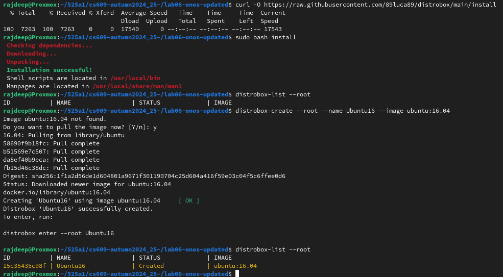

> [!NOTE]  
> We have just installed the required Ubuntu 16.04. So it is visible in the list. And you may verify it by seeing the list.


4. To enter the container `Ubuntu16`, use the following command:
```shell
distrobox enter --root Ubuntu16
```

> [!NOTE]
> You need to provide one password when the following prompt will be shown:  
> `First time user password setup`  
> `Enter new UNIX password:`  
> In that case, use the password `HelloSdn`  

You may consider the following reference:
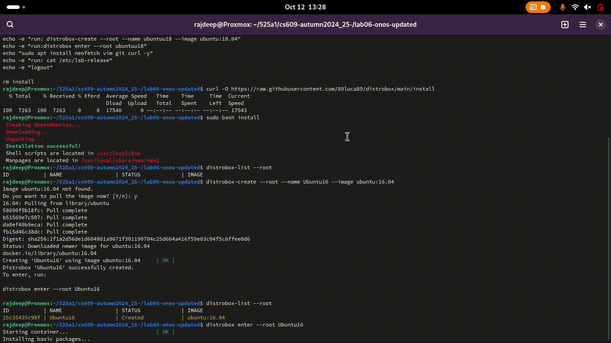

5. Run the command `cat /etc/lsb-release` and your output should be similar to following:
> [!NOTE]
> You should receive a similar output as follows:   
> `DISTRIB_ID=Ubuntu`  
> `DISTRIB_RELEASE=16.04`  
> `DISTRIB_CODENAME=xenial`  
> `DISTRIB_DESCRIPTION="Ubuntu 16.04.7 LTS"`  

6. The setup is ready. We are all set to install ONOS.


## 2.4. Installing ONOS on a single machine <a	name="2.4"></a>


1. We need to download some tools, for that we need the `curl` package. To install it, execute the following:
```shell
sudo apt install curl -y
```

2. Check the existing java version using the following command:
```shell
java -version
```
You should get a similar output as `bash: java: command not found`.

3. To install *OpenJDK 11*, use the following commands:
```shell
sudo apt update
```
and then run
```shell
sudo apt install openjdk-11-jdk -y
```

> [!NOTE] 
> If you receive an error like `E: Unable to locate package openjdk-11-jdk` then you need to do the following steps: 
> `sudo add-apt-repository ppa:openjdk-r/ppa` 
> Then `sudo apt-get update` 
> `sudo apt install openjdk-11-jdk -y`


4. Now again check the existing java version using the following command:
```shell
java -version
```
and your output should match with the following:

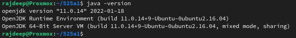


5. To set *Java HOME*, follow the steps:
```shell
sudo su
```
```shell
cat >> /etc/environment << EOL
```
```shell
JAVA_HOME=/usr/lib/jvm/java-11-openjdk-amd64
```
```shell
JRE_HOME=/usr/lib/jvm/java-11-openjdk-amd64/jre
```
```shell
EOL
``` 
6. To exit, type `exit`. For reference, you may have a look at the following snapshot:

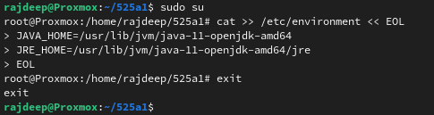

7. Please move to the`opt` directory by using the following command:
```shell
sudo mkdir /opt ; cd /opt
```
> [!NOTE]
> If the directory exists, you shouls get a message similar to following:  
> `mkdir: cannot create directory ‘/opt’: File exists`  


8. To download ONOS, use the following command:
```shell
sudo wget -c https://repo1.maven.org/maven2/org/onosproject/onos-releases/2.6.0/onos-2.6.0.tar.gz
```

9. Untar the downloaded file by the following command
```shell
sudo tar -xvf onos-2.6.0.tar.gz
```

10. Rename the extracted directory as follows:
```shell
sudo mv onos-2.6.0 onos
```

## 2.5. Cross-checking the installation process<a	name="2.5"></a>


1. Verify that ONOS services are working or not. To do it, run the following command:
```shell
sudo /opt/onos/bin/onos-service start
```

All should go well and you should be seeing an output similar to the following :

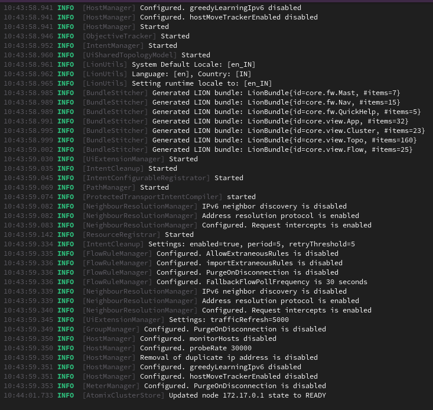

The overall procedure may be seen as follows:


2. Let us call this ongoing terminal as the `left-hand-side terminal` or `Terminal 1`.


# 3. Starting the components of ONOS<a	name="3"></a>


## 3.1. Starting Karaf <a	name="2.6"></a>


### 3.1.1. What is Karaf? <a	name="2.6.1"></a>


Karaf is a lightweight, powerful, and enterprise ready modulith runtime. It provides all the ecosystem and bootstrapping options you need for your applications. It runs on premise or on cloud. This modulith runtime supports several frameworks and different kind of applications: REST/API, Web, Spring Boot, and much more.

### 3.1.2. An example <a	name="2.6.2"></a>

Used by bunch of distributions, used as runtime and support by frameworks. According to [Karaf stories](https://karaf.apache.org/stories), some softwares use Apache Karaf as runtime.

**Netflix:** The Netflix media pipeline processes thousands of new shows and movies every day so that you can watch them on any device anywhere. We use a forward chaining rule engine to coordinate all of this work in multiple workflows. Hosting these workflows in a reliable, scalable and cost effective manner is a huge challenge at our scale. In this talk, we will introduce the design of Netflix’s next generation rule engine framework. The goal is to boost modularity, increase developer productivity and decrease operational overhead. The new system is a platform as a service that lets workflow developers focus on workflow data model, execution conditions, and remote function invocations without worrying about how to deploy, scale, and monitor it. The system uses the OSGI framework to build separation among workflows and leverages Apache Karaf as the runtime container. Other interesting topics such as workflow bundle management and a novel rule domain specific language will be covered in this talk. Keywords:nRule engine, OSGI, Apache Karaf, Serverless. You can find the [abstract here](https://www.apachecon.com/acna19/s/#/scheduledEvent/1209)

### 3.1.3. How is it related to ONOS? <a	name="2.6.3"></a>


According to the information by [Ayaka Koshibe](https://wiki.onosproject.org/display/ONOS/The%2BONOS%2BCLI), the ONOS CLI is an extension of Karaf's CLI. As a result, it is capable of leveraging features such as programmatic extensibility, the ability to load and unload bundles (among others), and SSH access.

### 3.1.4. Starting Karaf in a new terminal  <a	name="2.6.4"></a>


1. Open another terminal. Let us call this new terminal as `right-hand-side-terminal` or `Terminal 2`. Use SSH on `Terminal 2` to log in to your VM. Check the output of the following command in `terminal 2`:
```shell
cat /etc/lsb-release
```

> [!NOTE]
> The output should be as follows:  
> `DISTRIB_ID=Ubuntu`   
> `DISTRIB_RELEASE=22.04`   
> `DISTRIB_CODENAME=jammy`   
> `DISTRIB_DESCRIPTION="Ubuntu 22.04.5 LTS"`   


2. Execute the following command in `terminal 2`:
```shell
distrobox-enter --root Ubuntu16
```

3. Check the output of the following command in `terminal 2`:
```shell
cat /etc/lsb-release
```

> [!NOTE]
> The output should be as follows:  
> `DISTRIB_ID=Ubuntu`   
> `DISTRIB_RELEASE=16.04`   
> `DISTRIB_CODENAME=xenial`   
> `DISTRIB_DESCRIPTION="Ubuntu 16.04.7 LTS"`   


4. At this point, your screen should look like following:

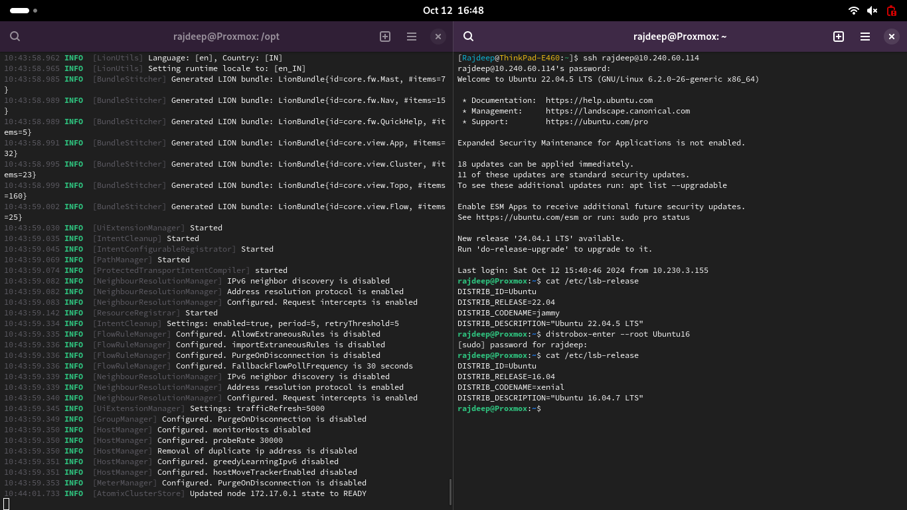


 Run the following commands in `Terminal 2` to access the CLI.


 
```shell
sudo /opt/onos/bin/onos -l karaf
```

5. Use the password `helloSdn` when prompted. You should exxperience a situation similar to follow:

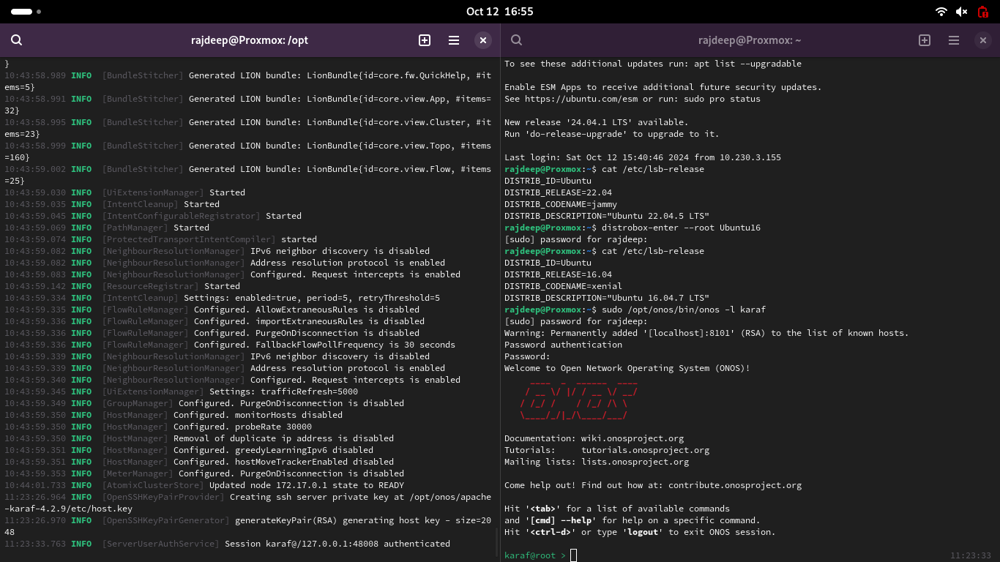

The overallall process is mentioned here:

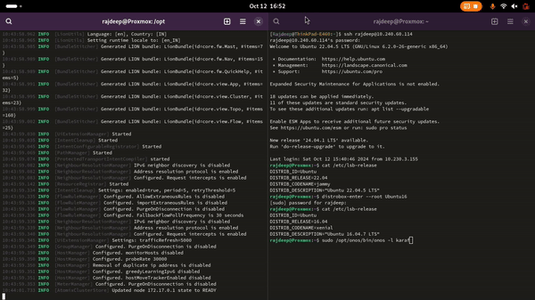

## 3.2. Running ONOS as a service  <a	name="2.7"></a>
Sometimes it’s useful to run ONOS as a service, particularly in production environments. This is where things get more complicated and specialized, depending on the operating system you’re running. 


### 3.2.1.  Install the service files  <a	name="271"></a>
Open another terminal. Let us call it *Terminal 3*. In *Terminal 3* execute the following command:
```shell
sudo cp /opt/onos/init/onos.initd /etc/init.d/onos
```
> [!NOTE]
> According to [Welcome to the Essay Debating System](https://wiki.debian.org/Debate) and [Debate Init System To Use](https://wiki.debian.org/Debate/initsystem), the open question is **which *init* system *Debian* should choose as default**. A comparison between [Upstart and systemd](https://wiki.ubuntu.com/SystemdForUpstartUsers) is also available. 

### 3.2.2.  Steps for Systemd based systems  <a	name="272"></a>

When ONOS runs as a service, the OS will start it automatically as part of the boot process. On systemd and upstart-based systems, it should also automatically be restarted if it crashes. Once the service configuration files have been installed, you can typically start, stop, and check the status of ONOS using the service command.

[As Ubuntu 16 is an systemd based system](https://wiki.ubuntu.com/systemd), we need the following commands:
```shell
sudo cp /opt/onos/init/onos.service /etc/systemd/system/
```
followed by
```shell
sudo systemctl daemon-reload
```
and also
```shell
sudo systemctl enable onos
```


## 3.3. Accessing the ONOS GUI  <a	name="29"></a>

1.  Open any browser in your local machine. Type the following URL and press the *Enter* button:
```shell
http://XX.YY.WW.ZZ:8181/onos/ui/index.html
```
where XX.YY.WW.ZZ is the IP address of your target machine, i.e., the IP given to you to access the VM. You should see a GUI similar to the following:

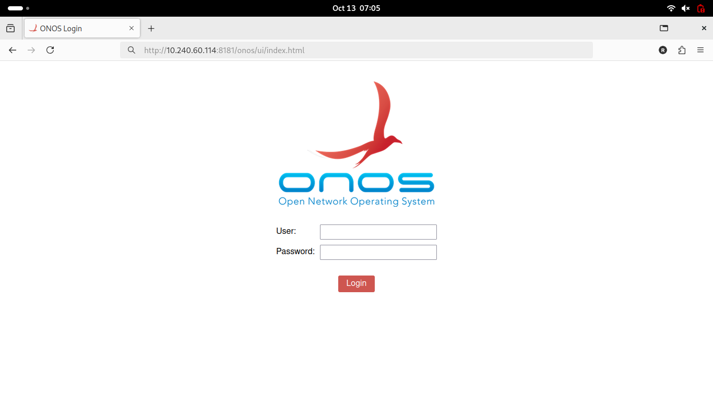

2.  Provide the following credential:
    -   username is *onos*, and
    -   password is *rocks*.


You should see a GUI similar to the following:

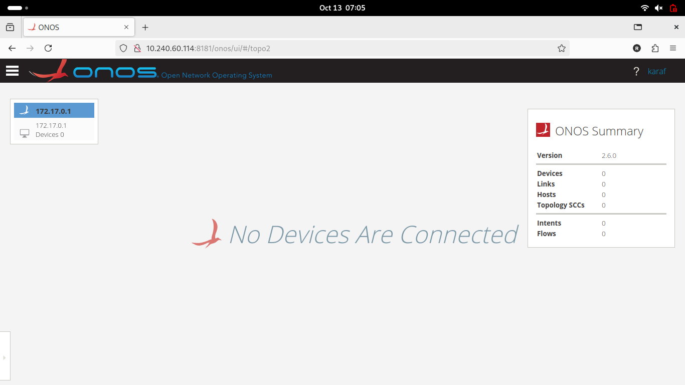

## 3.4. Starting ONOS CLI in a new terminal  <a	name="28"></a>

We need three terminals here. In all the three terminals, ssing SSH, log in to your VM. In the *Terminal 1*, type the following:
```shell
distrobox enter --root Ubuntu16
```
followed by

```shelll
sudo /opt/onos/bin/onos-service start
```
In the *Terminal 2*, type the following:
```shell
distrobox enter --root Ubuntu16
```
followed by

```shelll
sudo /opt/onos/bin/onos -l karaf
```

Use the following credentials:  
    -   username: karaf, and  
    -   password: karaf  


In the *Terminal 3*, type the following:
```shell
distrobox enter --root Ubuntu16
```
followed by

```shelll
sudo /opt/onos/bin/onos -l onos
```
Use the following credentials:
    -   username: onos, and
    -   password: rocks

You should see the ONOS CLI and Karaf CLI in *Terminal 2*, and *Terminal 3*, respecctively. The situation is depicted follows:

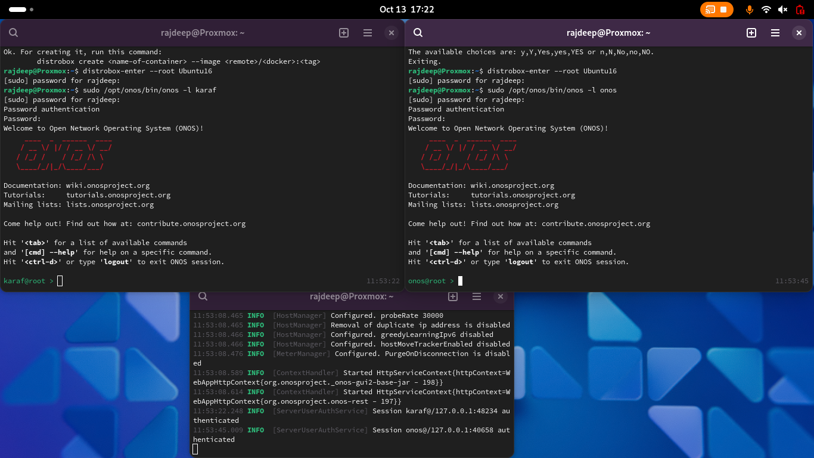

The full process is shown bellows:


/opt/onos/bin/onos


## Forming a cluster

# References <a	name="1"></a>


1.  [AI Assisted Automation Framework in ONOS](https://www.youtube.com/watch?v=vtnliDI4sFg)<a	name="ref1"></a>
2.  [Open Network Operating System](https://opennetworking.org/onos/)<a	name="ref2"></a>
3.  [ONOS Overview - ONF Bootcamp May 23, 2017](https://www.youtube.com/watch?v=XI3ckGAK84k&t=3s)<a	name="ref3"></a>
4.  [Open Network Operating System (ONOS) Wiki](https://wiki.onosproject.org/)<a	name="ref4"></a>
5.  [Administrator Guide](https://wiki.onosproject.org/display/ONOS/Administrator+Guide)<a	name="ref5"></a>
6.  [ONOS Developer's Google group](https://groups.google.com/a/onosproject.org/g/onos-dev)<a	name="ref6"></a>
7.  [ONOS GitHub repository](https://github.com/opennetworkinglab/onos)<a	name="ref7"></a>
