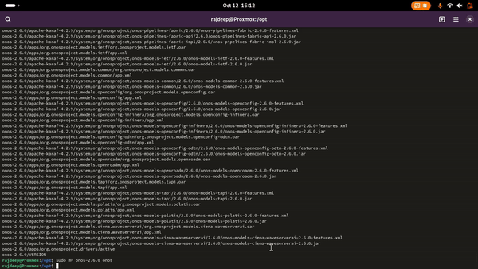

<h2 align="center" style="border-bottom: 5px dotted">
   <p> Software-Defined Networking and Network Function Virtualization (CS-609)</p>
    <p> Autumn 2024-25, Indian Institute of Technology Dharwad </p>
    <p> Lab Worksheet 06, Thursday morning session, 10th October 2024 </p>
    

</h2>

<h2 align="center" style="border-bottom: 5px dotted">
   <p> Topic covered: Open Network Operating System (ONOS)</p>
    

</h2>


<!---
## Lab - 04: OpenFlow

### 01-initial-setup
-->

**Lab objective:** Open Network Operating System 


# Some understanding


## What is ONOS?

According to [[2]](#ref2), Open Network Operating System (ONOS) is the leading open source SDN controller for building next-generation SDN/NFV solutions.

ONOS was designed to meet the needs of operators wishing to build carrier-grade solutions that leverage the economics of white box merchant silicon hardware while offering the flexibility to create and deploy new dynamic network services with simplified programmatic interfaces. ONOS supports both configuration and real-time control of the network, eliminating the need to run routing and switching control protocols inside the network fabric. By moving intelligence into the ONOS cloud controller, innovation is enabled and end-users can easily create new network applications without the need to alter the dataplane systems.

The ONOS platform includes:
-   A platform and a set of applications that act as an extensible, modular, distributed SDN controller.
-   Simplified management, configuration and deployment of new software, hardware & services.
-   A scale-out architecture to provide the resiliency and scalability required to meet the rigors of production carrier environments.


# Installing and running ONOS


## Specifications we shall be using for this lab worksheet

As on October 2024, I failed several time to install ONOS in Ubuntu 22.04. So based on that experience, I am going to use an older version of Ubuntu while using ONOS. We shall use Ubuntu 16.04 for this lab duration. 

1.  Login to your Proxmox VM using the credentials provided. First, check the version of Ubuntu you are given. Run the command `cat /etc/lsb-release` and your output should be similar to following:
> [!NOTE]
> You should receive a similar output as follows:   
> `DISTRIB_ID=Ubuntu`  
> `DISTRIB_RELEASE=22.04`  
> `DISTRIB_CODENAME=jammy`  
> `DISTRIB_DESCRIPTION="Ubuntu 22.04.5 LTS"`  

2. However while working with ONOS, we shall be using the following tools with the mentioned versions:
-   `Ubuntu 16.04`
-   `Mininet 2.2.1` 
-   `OpenJDK 11`


## Synchronize your working directory and navigate to the desired location

1. Please navigate to the GitHub repository by executing the following command:
```shell
cd 525a1/
``` 

2. Please execute the following command to synchrionize your *present working directory* with the GitHub repository:
```shell
git pull
```

3. To navigate tio the desired location, execute the following command:
```shell
cd cs609-autumn2024_25-/lab06-onos-updated/
```

## Preparation of the ground for installation of ONOS

### Working with docker

1.   Run the following command to download the required tools:
```shell
bash script01-blackbox01of02.sh
```
followed by:
```shell
bash script01-blackbox02of02.sh
```

### Working with Distrobox


1. To install distrobox, execute the following commands:
```shell
curl -O https://raw.githubusercontent.com/89luca89/distrobox/main/install
```

followed by

```shell
sudo bash install
```

2. To view the list of available distroboxes, run the following command:
```shell
distrobox-list --root
```

> [!NOTE]  
> As we have not yet created any distro using distrobox, this list should be empty.


3. Now we shall install Ubuntu 16 using distrobox. To do so, execute the following command in your terminal:
```shell
distrobox-create --root --name Ubuntu16 --image ubuntu:16.04
```
Run the following command to verify it:
```shell
distrobox-list --root
```
For reference, you may look at the following snapshot:


> [!NOTE]  
> We have just installed the required Ubuntu 16.04. So it is visible in the list. And you may verify it by seeing the list.


4. To enter the container `Ubuntu16`, use the following command:
```shell
distrobox enter --root Ubuntu16
```

> [!NOTE]
> You need to provide one password when the following prompt will be shown:  
> `First time user password setup`  
> `Enter new UNIX password:`  
> In that case, use the password `HelloSdn`  

You may consider the following reference:


5. Run the command `cat /etc/lsb-release` and your output should be similar to following:
> [!NOTE]
> You should receive a similar output as follows:   
> `DISTRIB_ID=Ubuntu`  
> `DISTRIB_RELEASE=16.04`  
> `DISTRIB_CODENAME=xenial`  
> `DISTRIB_DESCRIPTION="Ubuntu 16.04.7 LTS"`  

6. The setup is ready. We are all set to install ONOS.


## Installing on a single machine

1. We need to download some tools, for that we need the `curl` package. To install it, execute the following:
```shell
sudo apt install curl -y
```

2. Check the existing java version using the following command:
```shell
java -version
```
You should get a similar output as `bash: java: command not found`.

3. To install *OpenJDK 11*, use the following commands:
```shell
sudo apt update
```
and then run
```shell
sudo apt install openjdk-11-jdk -y
```

> [!NOTE] 
> If you receive an error like `E: Unable to locate package openjdk-11-jdk` then you need to do the following steps: 
> `sudo add-apt-repository ppa:openjdk-r/ppa` 
> Then `sudo apt-get update` 
> `sudo apt install openjdk-11-jdk -y`


4. Now again check the existing java version using the following command:
```shell
java -version
```
and your output should match with the following:


5. To set *Java HOME*, follow the steps:
```shell
sudo su
```
```shell
cat >> /etc/environment << EOL
```
```shell
JAVA_HOME=/usr/lib/jvm/java-11-openjdk-amd64
```
```shell
JRE_HOME=/usr/lib/jvm/java-11-openjdk-amd64/jre
```
```shell
EOL
``` 
6. To exit, type `exit`. For reference, you may have a look at the following snapshot:


7. Please move to the`opt` directory by using the following command:
```shell
sudo mkdir /opt ; cd /opt
```
> [!NOTE]
> If the directory exists, you shouls get a message similar to following:  
> `mkdir: cannot create directory ‘/opt’: File exists`  


8. To download ONOS, use the following command:
```shell
sudo wget -c https://repo1.maven.org/maven2/org/onosproject/onos-releases/2.6.0/onos-2.6.0.tar.gz
```

9. Untar the downloaded file by the following command
```shell
sudo tar -xvf onos-2.6.0.tar.gz
```

10. Rename the extracted directory as follows:
```shell
sudo mv onos-2.6.0 onos
```

11. Verify that ONOS is working. To do it, run the following command:
```shell
sudo /opt/onos/bin/onos-service start
```

All should go well and you should be seeing an output similar to the following :


The overall procedure may be seen as follows:





12. Let us call this ongoing terminal as the `left-hand-side terminal` or `Terminal 1`.


13. Open another terminal. Let us call this new terminal as ``right-hand-side-terminal` or `Terminal 2`. Use SSH on `Terminal 2` to log in to your VM. Check the output of the following command in `terminal 2`:
```shell
cat /etc/lsb-release
```
> [!NOTE]
> The output should be as follows:`  
> `DISTRIB_ID=Ubuntu`   
> `DISTRIB_RELEASE=22.04`   
> `DISTRIB_CODENAME=jammy`   
> `DISTRIB_DESCRIPTION="Ubuntu 22.04.5 LTS"`   


 Run the following commands in `Terminal 2` to access the CLI.
-   ``
```shell
sudo /opt/onos/bin/onos -l karaf
```


## Running ONOS as a service

## Accessing the CLI and GUI

## Forming a cluster

# References

1.  [AI Assisted Automation Framework in ONOS](https://www.youtube.com/watch?v=vtnliDI4sFg)<a	name="ref1"></a>
2.  [Open Network Operating System](https://opennetworking.org/onos/)<a	name="ref2"></a>
3.  [ONOS Overview - ONF Bootcamp May 23, 2017](https://www.youtube.com/watch?v=XI3ckGAK84k&t=3s)<a	name="ref3"></a>
